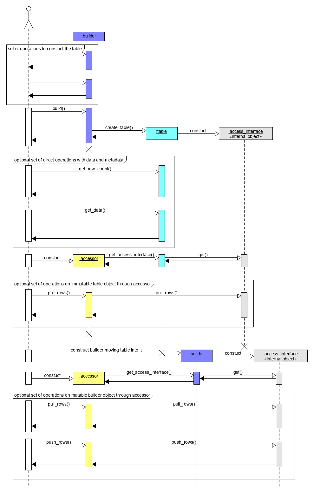

.. _data_management:

===============
Data management
===============

This section includes descriptions of concepts and objects that operate on data.
For |dal_short_name|, such set of operations, or **data management**, is
distributed between different stages of the :ref:`data analytics pipeline
<data_analytics_pipeline>`. From a perspective of data management, this pipeline
contains three main steps of data acquisition, preparation, and computation (see
on the picture below):

1. Raw data acquisition

  - Transfer out-of-memory data from various sources (databases, files, remote
    storages) into an in-memory representation.

2. Data preparation

  - Support different in-memory :term:`data formats <Data format>`.
  - Compress and decompress the data.
  - Convert the data into numeric representation.
  - Recover missing values.
  - Filter the data and perform data normalization.
  - Compute various statistical metrics for numerical data, such as mean, variance,
    covariance.

3. Algorithm computation

  - Stream in-memory numerical data to the algorithm.

In complex usage scenarios, data flow can go through these three stages back and
forth. For example, when the full data are not available at the start of the
computation, it can be done step-by-step with blocks of data. After computation
on the current block is completer, the next block should be obtained and
prepared.

.. image:: _static/data_management_flow.png
  :width: 800
  :alt: Typical data management flow

Key concepts
============

|dal_short_name| provides a set of concepts to operate on out-of-memory and
in-memory data during different stages of the :ref:`data analytics pipeline
<data_analytics_pipeline>`.

.. _dataset:

Dataset
--------

The most common concept over the data in |dal_short_name| is a :term:`dataset`.
This is an in-memory or out-of-memory tabular view of data, where table rows
represent :term:`observations <Observation>` and columns represent
:term:`features <Feature>`.

.. image:: _static/dataset.png
  :width: 400
  :alt: Dataset

The dataset comes across all stages of the data analytics pipeline. For example:

1. On the acquisition stage, it is downloaded into the
   local memory

2. On the preparation stage, it is converted to numerical
   representation

3. On the computation stage, it is used as one of the :ref:`inputs <Input>` or
   :ref:`results <Result>` of an algorithm or even can be found in its
   parameters

.. _data-source:

Data source
-----------

Data source is a concept of an out-of-memory storage of a :term:`dataset`. It is
used on data acquisition and data preparation stages for:

- Dataset extraction from databases, files, remote storages, etc.

- Dataset loading into the local memory of the device. Data are not always fit
  the local memory, especially when processing with accelerators. Data source
  provides an ability to load data by batches and orchestrates its efficient
  extraction directly into local memory of the device. Therefore data source
  enables complex scenarios of data analytics, like :term:`online computations
  <Online mode>`.

- Filtering or normalization of :term:`feature` values being extracted.

- Recovery (emulation) of missing :term:`feature` values.

- :term:`outlier` detection and recovery of the abnormal data.

- Dataset transformation to numerical representation. Data sources can
  automatically transform non-numeric :term:`categorical <Categorical feature>`
  and :term:`continuous <Continuous feature>` values of data into one of numeric
  :term:`data formats <Data format>`.

For details, see :ref:`data-sources` section.

.. _table:

Table
-----

Table is a concept of a :term:`dataset` with in-memory numerical data. It is
used on data-preparation and data-processing stages to:

- Store heterogeneous (in the general case) in-memory data with variety of
  :term:`data formats <Data format>` (dense, sparse, chunked, contiguous, etc.)

- Avoid unnecessary data copies on conversion from external data
  representations.

- Transfer memory ownership of the data from user responsibility to the table,
  or share it between them

- Connect with :ref:`data-source` to convert out-of-memory dataset
  representation to in-memory view

- Stream the data to the algorithm

- Access the underlying data on a device in a required :term:`data format`, e.g.
  by blocks of defined :term:`data layout`.

Table provide read-only access to the data inside it for thread-safety reasons
and better integration with external entities, thus, table concept is
:term:`immutable <Immutability>`.

This concept may also have different logical organization and physical
:term:`format of the data <data format>` inside it.

- Logically, table is a :ref:`dataset` with :math:`n` rows and
  :math:`p` columns. Each row represent an :term:`observation` and each column
  is a :term:`feature` of a dataset. Thus, table contains :math:`(n \times p)`
  data elements, while the original (physical) amount of bytes needed to store
  the data can be different.

- Physically, table can be organized in different ways: as a :term:`homogeneous
  <Homogeneous data>`, :term:`contiguous <Contiguous data>` array of bytes, as
  :term:`heterogeneous <Heterogeneous data>` list of arrays of different
  :term:`data types <Data type>`, in a compressed-sparse-row format, etc.

For details, see :ref:`tables` section.

.. _metadata:

Metadata
--------

Metadata concept is assotiated with a :ref:`dataset` and holds an information
about its structure and type. This information shall be enough to determine the
particular type of a dataset, and helps to understand how to interact with
dataset in |dal_short_name| (for example, how to use it on a particular stage of
:ref:`data analytics pipeline <data_analytics_pipeline>` or how to access its
data).

Metadata for all datasets shall contain:

- The number of rows :math:`n` and columns :math:`p` in a dataset

- Type of each :term:`feature` (e.g. :term:`nominal <Nominal feature>`,
  :term:`interval <Interval feature>`)

- :term:`data type` of each feature

- The kind of a dataset (e.g. :ref:`table` or :ref:`data-source`)

.. note::
  Metadata can contain both compile-time and run-time information. For example,
  basic compile-time metadata is the type of a dataset - whether it is a
  particular :ref:`data-source` or a :ref:`table`. Run-time information can
  contain the :term:`feature` types and :term:`data types <Data type>` of a
  dataset.

.. note::
  Each concept that concretizes a dataset definition (like different tables or
  data sources) shall contain additional metadata which describes this concept
  as the whole. For example, :ref:`data-source` and :ref:`table` concepts have
  different sets of metadata since they represent different kinds of a
  :term:`dataset`.

.. _table-builder:

Table builder
-------------

A table :term:`builder` is a concept that associated with particular
:ref:`table` type and is used on data-preparation and data-processing stages
for:

- Iterative (in general case) construction of a :ref:`table` from
  another :ref:`tables <table>` or different in-memory :ref:`dataset`
  representations

- Construction of a :ref:`table` from different entities that hold pieces of the
  dataset, like arrays, pointers to the memory, external entities, etc.

- Changing dataset values. Since :ref:`table` is an
  :term:`immutable <Immutability>` dataset, builder provides an ability to
  change the values of data in the dataset under construction.

- Incapsulating construction process of a :ref:`table`. This is used to hide an
  implementation details, which (1) are unnecessary for user, (2) allow to
  select most appropriate table implementation for every particular case.

- Providing an additional information how to create a :ref:`table` inside an
  algorithm for :ref:`results  <Result>`. This information may include metadata,
  memory allocators need to be used, or even particular implementation of a
  table.

For details, see :ref:`table-builders` section.

.. _accessor:

Accessor
--------

Accessor is a concept which defines sinle way how to get the data from a
in-memory numerical :ref:`dataset`. It allows:

- To make uniform access to the data from various sets of different objects,
  like :ref:`tables <Table>` or :ref:`table builders <table-builder>` without
  exposing their implementation details.

- To convert a variety of numeric :term:`data formats <Data format>` into a
  smaller set (e.g. for better vectorization).

- To give an ability to focus on the data acquisition in the desired :term:`data
  format` with a wanted set of operations over the data.

- To make read-only, read-write and write-only access to the data.

For details, see :ref:`accessors` section.

Use-case example for table, accessor and table builder
------------------------------------------------------

This section gives an basic usage scenario of :ref:`table`, :ref:`table-builder`
and :ref:`accessor` concepts and relations between them. The following diagram
shows objects of these concepts, which are highlighted by colors:

- :ref:`table-builder` objects are blue

- :ref:`table` objects are cyan

- :ref:`accessors <Accessor>` are yellow

- objects with gray background color are not a part of |dal_short_name|
  specification and they are provided just for illustration purposes

To perform some computations based on the dataset, one shall create a
:ref:`table` object first. It can be done using :ref:`data-source` or
:ref:`table-builder` objects depending on the situation. The diagram briefly
shows a situation when :ref:`table` is created from :ref:`table-builder`
interatively with calls of various member functions that update internal state
of the builder. Then, the `build()` method is called which takes a snapshot of
current builder state and creates a table from it.

Once table object created, the data inside it can be accessed using member
functions of table object or with help of read-only accessor as shown on the
diagram. Table can be used in the computations as input or parameter of some
algorithm.

Algorithms results also contain table objects. If one needs to change the data
inside some table, builder object can be constructed for this. If table object
is unique (just only one reference exists), it can be moved inside builder -
thus no copy operations of data will be performed. Data inside table builder can
be retrieved by read-only, write-only or read-write accessors.

Accessors present on the diagram allows to get data uniformly from tables and
table builders as blocks of rows.

Internal "access_interface" object present on the diagram depicts how table and
table builder may share one implementation with different set of operations
defined upon it on different stages of the lifetime. It shows how accessor
object might know how to get data from different kind of objects.

Details
=======

.. toctree::

   data_sources.rst
   tables.rst
   table_builders.rst
   accessors.rst
