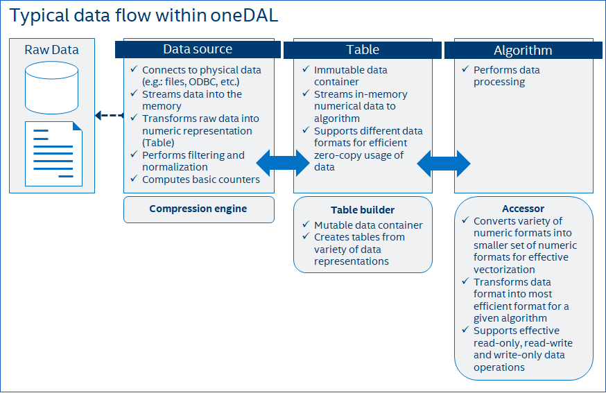

.. _data_management:

===============
Data management
===============

Effective data management is among key constituents of the performance of a data
analytics application. For |dal_short_name|, effective data management requires
effectively performing the following operations:

- raw data acquisition
- filtering and normalization
- data conversion to a numeric representation
- data streaming to an algorithm

Key concepts
============

|dal_short_name| provides a set of customizable interfaces to operate on
out-of-memory and in-memory data in different usage scenarios, which include
:term:`batch processing <Batch mode>`, :term:`online processing <Online mode>`,
and complex scenarios.

Table
-----

To represent a :term:`dataset` in a numeric :term:`data format`,
|dal_short_name| introduces a :term:`table` concept - an :term:`immutable
<Immutability>` tabular view of a :term:`dataset` where table rows represent
:term:`observations <Observation>` and columns represent :term:`features
<Feature>`.

.. image:: _static/table.png
  :width: 400
  :alt: Table

|dal_short_name| defines a set of table types, each represent data in
various :term:`data formats <Data format>`. See :ref:`tables` section for more
details about requirements of table types and table concept.

Data source
-----------

Data source defines an interface to extract data from raw sources like files,
databases, etc. and to represent them as a :term:`table` object. It can
automatically transform non-numeric :term:`categorical <Categorical feature>`
and :term:`continuous <Continuous feature>` values of data into a numeric
representation.

It can also provide an abilities to filter or normalize :term:`feature` values
being extracted or recover missing values:

- It is not a rare situation when only a subset of features can be measured at a
  given moment. In this case, the non-measured features in the feature vector
  become blank, or missing. Special statistical techniques enable recovery
  (emulation) of missing values.

- When a given measurement introduces an :term:`outlier` or when an observed
  object can produce an :term:`outlier` by nature, special statistical techniques
  enable detection of outliers and recovery of the abnormal data.

Data are not always fit the local memory, especially when processing with
accelerators. Data source provides an interface to load data by batches and
orchestrates its efficient extraction directly into local memory of the device.
Therefore data source enables complex scenarios of data analytics, like
:term:`online computations <Online mode>`.

Table builder
-------------

Some :term:`table` objects require complex procedures to create them. To make
easy-of-use table creation from data of various :term:`data formats <Data
format>` or other objects of different types, |dal_short_name| introduces a
special :term:`builder` concept for table types. See :ref:`table builders
<table_builders>` section for details.

Accessor
--------

There are a lot of :term:`data formats <Data format>` used in :term:`datasets
<Dataset>` to store the data. |dal_short_name| defines different types of
:term:`tables <Table>`, table builders and other objects to support different
logical types of data and various :term:`data formats <Data format>`. However,
all these objects have different logic to access their underlying data.

Accessor allows:

- to make uniform access to the data from various sets of objects of different
  types.

- to perform efficient access to the data without exposing implementation
  details of a data container.

- to give an ability to focus on the data acquisition in the desired :term:`data
  format` with a wanted set of operations over the data.

See :ref:`accessors` section for details.

Relations between concepts
==========================

Typical workflow with data in |dal_short_name| consists of next steps:

1. Select an appropriate data source for extracting out-of-memory data, or
   select a table builder to manually create a table object.

2. Create :term:`table` object - a numerical representation of data, with use
   of selected data source, table builder or table objetc constructor directly.

3. Run a selected :ref:`algorithm <Algorithms>` with created table object.

4. Get algorithm :ref:`results <Result>` and access their data directly or using
   selected accessor.

Next sequence diagram briefly shows dependencies between table, builder, and
accessor concepts.

Builder is responcible to create a table object, which data can be accessed
either directly using table interface or with help of accessor object. Since the
table object is immutable, this is not possible to change the data inside it.

To change the data of table object, its data should be moved inside builder
object. Once it done, data inside builder can be changed by the accessor.

See sections about :ref:`tables`, :ref:`table builders <table_builders>`, and
:ref:`accessors` for details.

.. image:: _static/table_builder_accessor_sequence.png
  :width: 800
  :alt: Sequence diagram of accessor-builder-table relations

Details
=======

.. toctree::

   tables.rst
   table_builders.rst
   accessors.rst
