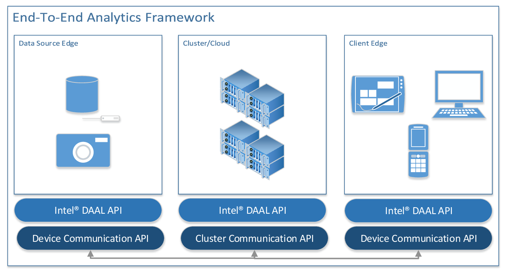

.. SPDX-FileCopyrightText: 2019-2020 Intel Corporation
..
.. SPDX-License-Identifier: CC-BY-4.0

============
Introduction
============

.. _data_analytics_pipeline:

|dal_full_name| (|dal_short_name|) is a library that provides building
blocks covering all stages of data analytics: data acquisition from a
data source, preprocessing, transformation, data mining, modeling,
validation, and decision making.

.. image:: _static/data_analytics_stages.png
  :width: 800
  :alt: Data analytis stages

|dal_short_name| supports the concept of the end-to-end analytics when
some of data analytics stages are performed on the edge devices (close
to where the data is generated and where it is finally
consumed). Specifically, |dal_short_name| Application Programming
Interfaces (APIs) are agnostic about a particular cross-device
communication technology and, therefore, can be used within different
end-to-end analytics frameworks.

|dal_short_name| consists of the following major components:

 - The :txtref:`Data Management <data_management>` component includes
   classes and utilities for data acquisition, initial preprocessing
   and normalization, for data conversion into numeric formats
   (performed by one of supported Data Sources), and for model
   representation.

 - The :txtref:`Algorithms <algorithms>` component consists of classes
   that implement algorithms for data analysis (data mining) and data
   modeling (training and prediction). These algorithms include
   clustering, classification, regression, and recommendation
   algorithms.  Algorithms support the following computation modes:

   - :txtref:`Batch processing <Batch>`: algorithms work with the entire
     data set to produce the final result

   - :txtref:`Online processing <Online>`: algorithms process a data set
     in blocks streamed into the device’s memory

   - :txtref:`Distributed processing <Distributed>`: algorithms operate
     on a data set distributed across several devices (compute nodes)

     Distributed algorithms in |dal_short_name| are abstracted from
     underlying cross-device communication technology, which enables
     use of the library in a variety of multi-device computing and
     data transfer scenarios.

   Depending on the usage, algorithms operate both on actual data
   (data set) and data models:

   - Analysis algorithms typically operate on data sets.

   - Training algorithms typically operate on a data set to train an
     appropriate data model.

   - Prediction algorithms typically work with the trained data model
     and with a working data set.

 - The **Utilities** component includes auxiliary functionality
   intended to be used for design of classes and implementation of
   methods such as memory allocators or type traits.

 - The **Miscellaneous** component includes functionality intended to
   be used by |dal_short_name| algorithms and applications for
   algorithm customization and optimization on various stages of the
   analytical pipeline. Examples of such algorithms include solvers
   and random number generators.

Classes in Data Management, Algorithms, Utilities, and Miscellaneous
components cover the most important usage scenarios and allow seamless
implementation of complex data analytics workflows through direct API
calls. At the same time, the library is an object-oriented framework
that helps customize the API by redefining particular classes and
methods of the library.
