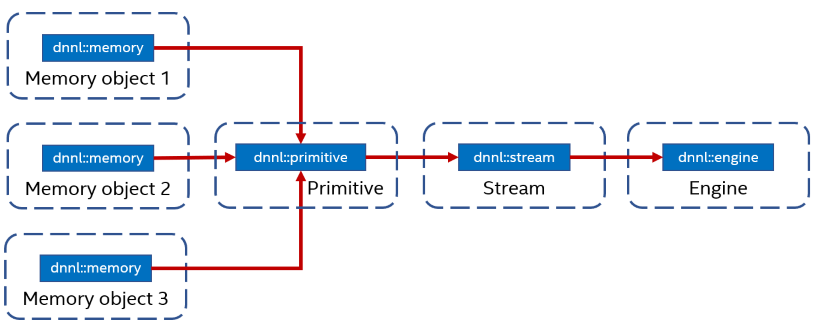

.. SPDX-FileCopyrightText: 2019-2020 Intel Corporation
..
.. SPDX-License-Identifier: CC-BY-4.0

.. default-domain:: cpp

.. include:: /elements/oneDNN/source/replacements.inc.rst

###############
Execution Model
###############

To execute a primitive, a user needs to pass memory arguments and a stream to
the |primitive::execute| member function.

The primitive's computations are executed on the computational device
corresponding to the engine on which the primitive (and memory arguments) were
created and happens within the context of the stream.

******
Engine
******

*Engine* is abstraction of a computational device: a CPU, a specific GPU card
in the system, etc. Most primitives are created to execute computations on one
specific engine. The only exceptions are reorder primitives that transfer data
between two different engines.

Engines correspond to and can be constructed from pairs of the DPC++
:class:`sycl::device` and :class:`sycl::context` objects. Alternatively, oneDNN
itself can create and own the corresponding objects.

.. doxygenstruct:: dnnl::engine
   :project: oneDNN
   :members:

.. doxygenfunction:: dnnl::sycl_interop::make_engine
   :project: oneDNN

.. doxygenfunction:: dnnl::sycl_interop::get_device
   :project: oneDNN

.. doxygenfunction:: dnnl::sycl_interop::get_context
   :project: oneDNN

******
Stream
******

A *stream* is an encapsulation of execution context tied to a particular
engine. They are passed to |primitive::execute| when executing a
primitive.

Streams correspond to and can be constructed from DPC++ :class:`sycl::queue`
objects. Alternatively, oneDNN itself can create and own the corresponding
objects. Streams are considered to be ephemeral and can be created / destroyed
as long these operation do not violate DPC++ synchronization requirements.

Similar to DPC++ queues, streams can be in-order and out-of-order (see the
relevant portion of the DPC++ specification for the explanation). The desired
behavior can be specified using |stream::flags| value. A stream
created from a DPC++ queue inherits its behavior.

.. doxygenstruct:: dnnl::stream
   :project: oneDNN
   :members:

.. doxygenfunction:: dnnl::sycl_interop::make_stream
   :project: oneDNN

.. doxygenfunction:: dnnl::sycl_interop::get_queue
   :project: oneDNN

.. vim: ts=3 sw=3 et spell spelllang=en
