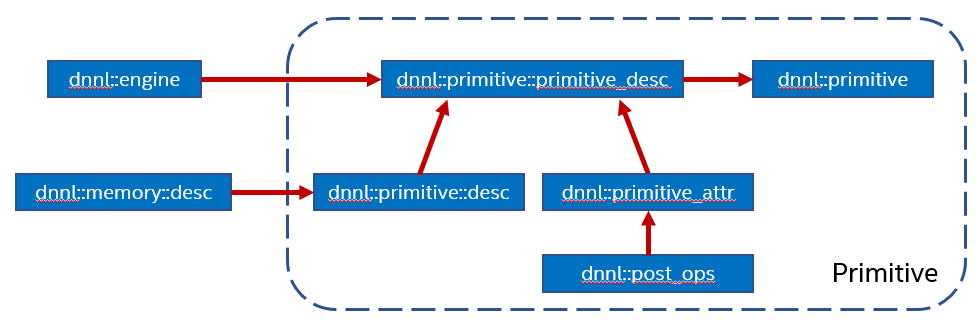

.. SPDX-FileCopyrightText: 2019-2020 Intel Corporation
..
.. SPDX-License-Identifier: CC-BY-4.0

.. default-domain:: cpp

.. include:: /elements/oneDNN/source/replacements.inc.rst

##########
Primitives
##########

*Primitives* are functor objects that encapsulate a particular computation such
as forward convolution, backward LSTM computations, or a data transformation
operation. A single primitive can sometimes represent more complex fused
computations such as a forward convolution followed by a ReLU.

The most important difference between a primitive and a pure function is that a
primitive can store state.

One part of the primitive's state is immutable. For example, convolution
primitives store parameters like tensor shapes and can pre-compute other
dependent parameters like cache blocking. This approach allows oneDNN primitives
to pre-generate code specifically tailored for the operation to be performed.
The oneDNN programming model assumes that the time it takes to perform the
pre-computations is amortized by reusing the same primitive to perform
computations multiple times.

The mutable part of the primitive's state is referred to as a scratchpad. It is
a memory buffer that a primitive may use for temporary storage only during
computations. The scratchpad can either be owned by a primitive object (which
makes that object non-thread safe) or be an execution-time parameter.

Conceptually, oneDNN establishes several layers of how to describe a computation
from more abstract to more concrete:

* Operation descriptors (one for each supported primitive) describe an
  operation's most basic properties without specifying, for example, which
  engine will be used to compute them. For example, convolution descriptor
  describes shapes of source, destination, and weights tensors, propagation kind
  (forward, backward with respect to data or weights), and other
  implementation-independent parameters. The shapes are usually described as
  memory descriptors (|memory::desc|).

* Primitive descriptors are at the abstraction level in between operation
  descriptors and primitives. They combine both an operation descriptor and
  primitive attributes. Primitive descriptors can be used to query various
  primitive implementation details and, for example, to implement :ref:`memory
  format propagation <memory_format_propagation-label>` by inspecting expected
  memory formats via queries without having to fully instantiate a primitive.
  oneDNN may contain multiple implementations for the same primitive that can be
  used to perform the same particular computation. Primitive descriptors allow
  one-way iteration which allows inspecting multiple implementations. The
  library is expected to order the implementations from most to least preferred,
  so it should always be safe to use the one that is chosen by default.

* Primitives, which are the most concrete, embody actual computations that can
  be executed.

On the API level:

* Primitives are represented as a class on the top level of the ``dnnl``
  namespace that have |primitive| as their base class, for
  example |convolution_forward|

* Operation descriptors are represented as classes named ``desc`` and nested
  within the corresponding primitives classes, for example
  |convolution_forward::desc|. The |primitive_desc::next_impl| member function
  provides a way to iterate over implementations.

* Primitive descriptors are represented as classes named ``primitive_desc``
  and nested within the corresponding primitive classes that have
  |primitive_desc_base| as their base class (except for RNN primitives that
  derive from |rnn_primitive_desc_base|), for example
  |convolution_forward::primitive_desc|

.. code-block:: c++

   namespace dnnl {
      struct something_forward : public primitive {
         struct desc {
            // Primitive-specific constructors.
         }
         struct primitive_desc : public primitive_desc_base {
            // Constructors and primitive-specific memory descriptor queries.
         }
      };
   }

The sequence of actions to create a primitive is:

1. Create an operation descriptor via, for example,
   |convolution_forward::desc|. The operation descriptor can contain memory
   descriptors with placeholder |memory::format_tag::any| memory formats if the
   primitive supports it.
2. Create a primitive descriptor based on the operation descriptor, engine and
   attributes.
3. Create a primitive based on the primitive descriptor obtained in step 2.

.. note::

   Strictly speaking, not all the primitives follow this sequence. For example,
   the reorder primitive does not have an operation descriptor and thus does not
   require step 1 above.

.. toctree::
   :maxdepth: 1

   general.rst
   attributes/index.rst
   batch_normalization.rst
   binary.rst
   concat.rst
   convolution.rst
   eltwise.rst
   inner-product.rst
   layer_normalization.rst
   logsoftmax.rst
   lrn.rst
   matmul.rst
   pooling.rst
   reorder.rst
   resampling.rst
   rnn.rst
   shuffle.rst
   softmax.rst
   sum.rst

.. vim: ts=3 sw=3 et spell spelllang=en
