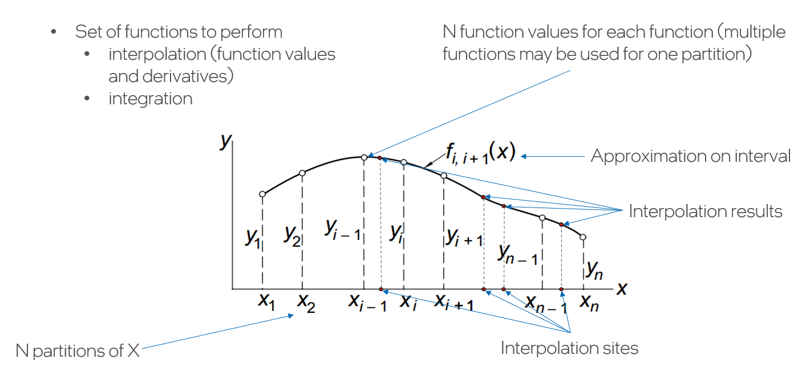

.. SPDX-FileCopyrightText: 2022 Intel Corporation
..
.. SPDX-License-Identifier: CC-BY-4.0

.. _terms:

Common Terms
============

Glossary
--------

Assume we need to interpolate a function ``f(x)`` on the ``[a, b)`` interval using splines.

We define a **partition** of `[a, b)` to be a collection of :math:`n` points
(**partition points**) :math:`\left\{ x_{i}\right\}, i = 1, \dots, n` such as
:math:`a = x_1 < x_2 < \dots < x_n = b`.
In general when there is no condition with respect to the distances between the :math:`x_i`,
the partition is referred to as a **non-uniform partition**.

Spline has ``k`` degree if it can be expressed by the following polynomial:

.. math::
  P\left( x \right) =
  c_{1} +
  c_{2}\left( x - x_i \right) +
  c_{3}{\left( x - x_i \right)}^2 + \dots +
  c_{k-1}{\left( x - x_i \right)}^k.

Splines are constructed on the partition subintervals
:math:`[x_i, x_{i+1}), i=1,\dots,n-1` sub-intervals.
So, for each sub-interval there are following polynomials:

.. math::
  P_i\left( x \right) =
  c_{1,i} +
  c_{2,i}\left( x - x_i \right) +
  c_{3,i}{\left( x - x_i \right)}^2 + \dots +
  c_{k-1,i}{\left( x - x_i \right)}^k.

The scalars :math:`c_{j,i}, j=1,\dots,k, i=1,\dots,n` are called spline **coefficients**.

Given an interpolant spline of :math:`f(x)` on a partition of :math:`[a,b)`,
the interpolant function can be evaluated at any point in the interval :math:`[a,b)` or
outside it (see :ref:`interpolate` for details). Such points to evaluate the interpolant at
will be referred to as **interpolation sites** or simply **sites**.
Sites can correspond to partition points, but are not required to be.

Mathematical Notation in the Data Fitting Component
---------------------------------------------------

.. list-table::
   :header-rows: 1

   * - Concept
     - Mathematical Notation
   * - Partition
     - :math:`\left\{ x_i \right\}_{i=1,\dots,n}`,
       where :math:`a = x_1 < x_2 < \dots < x_n = b`.
   * - Uniform partition
     - Partition :math:`\left\{ x_i \right\}_{i=1,\dots,n}`
       which meets the following condition:

       :math:`x_{i+1} - x_i = x_i - x_{i-1}, i=2,\dots,n-1`
   * - Quasi-uniform partition
     - Partition :math:`\left\{ x_i \right\}_{i=1,\dots,n}`
       which meets the constraint with a constant ``C`` defined as:
       :math:`1 \le M_max / M_min \le C`,

       where

       :math:`M_max = \text{max}_{i=1,\dots,n-1} (x_{i+1} - x_i)`,

       :math:`M_min = \text{min}_{i=1,\dots,n-1} (x_{i+1} - x_i)`,
   * - Vector-valued function of dimension ``m``
     - :math:`f(x) = (f_1(x),\dots, f_m(x))`.
   * - A ``d``-order derivative of function ``f(x)`` at point ``t``
     - :math:`f^{(d)}(t)`.
   * - Function ``p`` agrees with function ``f`` at the points
       :math:`\left\{ x_i \right\}_{i=1,\dots,n}`.
     - For every point :math:`\zeta` in sequence :math:`\left\{ x_i \right\}_{i=1,\dots,n}`
       the equality :math:`p^{(d)}(\zeta) = f^{(d)}(\zeta)`
       holds for all :math:`d=0,\dots,s` if ``p`` and ``f``
       are ``s``-times differentiable.
   * - The ``k``-th divided difference of function ``f`` at points :math:`x_i,..., x_{i+k}`.
       This difference is the leading coefficient of the polynomial of order ``k+1``
       that agrees with ``f`` at :math:`x_i,\dots, x_{i+k}`.
     - :math:`\left[  x_i,\dots, x_{i + k} \right]f`.

       In particular,

       :math:`\left[ x_1 \right]f = f(x_1)`,

       :math:`\left[  x_1, x_2 \right] f = (f(x_1) - f(x_2)) / (x_1 - x_2)`.

Hints in the Data Fitting Component
-----------------------------------

The oneMKL Data Fitting component provides ways to specify some "hints"
for partitions, function values, coefficients, interpolation sites.

Partition Hints
^^^^^^^^^^^^^^^

The following are supported:

 - Non-uniform.
 - Quasi-uniform.
 - Uniform.

**Syntax**

.. code:: cpp

  enum class partition_hint {
    non_uniform,
    quasi_uniform,
    uniform
  };

Function Values Hints
^^^^^^^^^^^^^^^^^^^^^

Let :math:`\left\{ x_i \right\}_{i=1,\dots,nx}` be a partition,
:math:`\left\{ f_j(x) \right\}_{j=1,\dots,ny}` be a vector-valued function.
Function values are stored in the one-dimensional array with ``nx * ny`` elements.
2 different layouts are possible: row major and column major.

- For row major layout function values are stored as the following:

  Let :math:`\left\{ f_{j,i} \right\}_{j=1,\dots,ny, i=1,\dots,nx}`
  be the function value that corresponds to the ``i-th`` partition point and the ``j-th`` function.

- For column major:

  Let :math:`\left\{ f_{i,j} \right\}_{i=1,\dots,nx, j=1,\dots,ny}`
  be the function value that corresponds to the ``i-th`` partition point and the ``j-th`` function.

The following hints are supported:

 - Row major.
 - Column major.

**Syntax**

.. code:: cpp

  enum class function_hint {
    row_major,
    col_major
  };

Coefficients Hints
^^^^^^^^^^^^^^^^^^

Let :math:`\left\{ x_i \right\}_{i=1,\dots,nx}` be a partition of :math:`[a,b)` and
:math:`f(x) = \left\{ f_j(x) \right\}_{j=1,\dots,ny}` be a vector-valued function
to be interpolated with a cubic spline on this partition.
To create a cubic spline, on each sub-interval in the partition, we require 4 coefficients per component :math:`f_j(x)` of :math:`f(x)`. The coefficients are stored in a one-dimensional array with :math:`4 * (nx - 1) * ny` elements.

- For row major:

  Let :math:`\left\{ c_{j,i,k} \right\}_{j=1,\dots,ny, i=1,\dots,nx-1, k=1,\dots,4}`
  be the coefficient value that corresponds to the ``i-th`` partition point, the ``j-th`` function.

- For column major:

  Let :math:`\left\{ c_{i,j,k} \right\}_{i=1,\dots,nx-1, j=1,\dots,ny, k=1,\dots,4}`
  be the coefficient value that corresponds to the ``i-th`` partition point, the ``j-th`` function.

The following is supported:

 - row major

**Syntax**

.. code:: cpp

  enum class coefficient_hint {
    row_major
  };

Sites Hints
^^^^^^^^^^^

The following are supported:

 - Non-uniform.
 - Uniform.
 - Sorted.

**Syntax**

.. code:: cpp

  enum class site_hint {
    non_uniform,
    uniform,
    sorted
  };

Interpolation Results Hints
^^^^^^^^^^^^^^^^^^^^^^^^^^^

Let :math:`\left\{ f_j(x) \right\}_{j=1,\dots,ny}` be a vector-valued function,
:math:`\left\{ s_i \right\}_{i=1,\dots,ns}` are sites, ``d`` is a number of derivatives (including interpolation values) that needs to be calculated.
So, size of memory to store interpolation results is ``nsite * ny * d`` elements.

6 different layouts are possible:

 - functions-sites-derivatives

   Let :math:`\left\{ r_{j,i,k} \right\}_{j=1,\dots,ny, i=1,\dots,nsite, k=1,\dots,d}`
   be an interpolation result that corresponds to the ``i-th`` site,
   the ``j-th`` function, the ``k-th`` derivative.

 - functions-derivatives-sites

   Let :math:`\left\{ r_{j,k,i} \right\}_{j=1,\dots,ny, k=1,\dots,d, i=1,\dots,nsite}`
   be an interpolation result that corresponds to the ``i-th`` site,
   the ``j-th`` function, the ``k-th`` derivative.

 - sites-functions-derivatives

   Let :math:`\left\{ r_{i,j,k} \right\}_{i=1,\dots,nsite, j=1,\dots,ny, k=1,\dots,d}`
   be an interpolation result that corresponds to the ``i-th`` site,
   the ``j-th`` function, the ``k-th`` derivative.

 - sites-derivatives-functions

   Let :math:`\left\{ r_{i,k,j} \right\}_{i=1,\dots,nsite, k=1,\dots,d, j=1,\dots,ny}`
   be an interpolation result that corresponds to the ``i-th`` site,
   the ``j-th`` function, the ``k-th`` derivative.

 - derivatives-functions-sites

   Let :math:`\left\{ r_{k,j,i} \right\}_{k=1,\dots,d, j=1,\dots,ny, i=1,\dots,nsite}`
   be an interpolation result that corresponds to the ``i-th`` site,
   the ``j-th`` function, the ``k-th`` derivative.

 - derivatives-sites-functions

   Let :math:`\left\{ r_{k,i,j} \right\}_{k=1,\dots,d, i=1,\dots,nsite, j=1,\dots,ny}`
   be an interpolation result that corresponds to the ``i-th`` site,
   the ``j-th`` function, the ``k-th`` derivative.

The following are supported:

 - functions-sites-derivatives
 - functions-derivatives-sites
 - sites-functions-derivatives
 - sites-derivatives-functions

**Syntax**

.. code:: cpp

  enum class interpolate_hint {
    funcs_sites_ders,
    funcs_ders_sites,
    sites_funcs_ders,
    sites_ders_funcs
  };

Derivatives Hints
^^^^^^^^^^^^^^^^^

Following hints are added to choose which derivtive orders
need to be computed during the ``interpolate`` function:

 - just compute interpolation values
 - compute first derivative of the spline polynomial only
 - compute second derivative of the spline polynomial only
 - compute third derivative of the spline polynomial only

**Syntax**

.. code:: cpp

  enum class derivatives {
    zero,
    first,
    second,
    third
  };

``operator|`` is overloaded to create combinations of derivative orders
to be computed by ``interpolate``.

**Example**

Assume that interpolation values, 1-st and 3-rd derivatives need to be computed.
To create a bit mask that is passed to ``interpolate`` it needs following:

.. code:: cpp

   std::bitset<32> bit_mask = derivatives::zero | derivatives::first | derivatives::third;

Boundary Condition Types
------------------------

Some type of splines requires boundary conditions to be set.
The following types are supported:

 - Free end (:math:`f^{(2)}(x_1) = f^{(2)}(x_n) = 0`).
 - Not-a-knot.
 - Periodic.
 - First derivative.
 - Second Derivative.

**Syntax**

.. code:: cpp

  enum class bc_type {
    free_end,
    not_a_knot,
    first_left_der,
    first_right_der,
    second_left_der,
    second_right_der,
    periodic
  };

.. note::

 #. First derivative and second derivative types
    must be set on the left and on the right borders.
 #. Free end doesn't require any values to be set.
