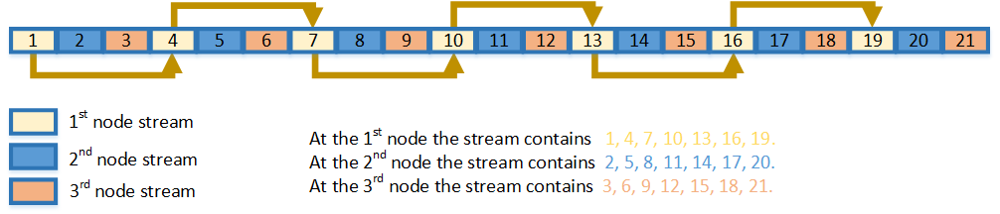

.. SPDX-FileCopyrightText: 2019-2020 Intel Corporation
..
.. SPDX-License-Identifier: CC-BY-4.0

.. _onemkl_rng_leapfrog:

leapfrog
========

Proceed state of engine by the leapfrog method.

.. _onemkl_rng_leapfrog_description:

.. rubric:: Description and Assumptions

oneapi::mkl::rng::leapfrog function generates random numbers in an engine with non-unit stride. This feature is particularly useful in distributing random numbers from the original stream across the stride buffers without generating the original random sequence with subsequent manual distribution. see `Figure "Leapfrog Method" <#rng_leapfrog>`__.

.. container:: figtop
    :name: rng_leapfrog

    Leapfrog Method

    |image0|

.. _onemkl_rng_leapfrog_common:

leapfrog
--------

.. rubric:: Syntax

.. code-block:: cpp

    namespace oneapi::mkl::rng {
    template<typename EngineType>
    void oneapi::mkl::rng::leapfrog(EngineType& engine, std::uint64_t idx, std::uint64_t stride);
    }

.. container:: section

    .. rubric:: Template Parameters

    EngineType
        Type of engine. Note: may not be supported by all available engine classes.

.. container:: section

    .. rubric:: Input Parameters

    engine
        Engine which state would be skipped.

    idx
        Index of the computational node.

    stride
        Largest number of computational nodes, or stride.

.. rubric:: Example

.. code-block:: cpp

    // Creating 3 identical engines
    mkl::rng::mcg31m1 engine_1(queue, seed);

    mkl::rng::mcg31m1 engine_2(engine_1);
    mkl::rng::mcg31m1 engine_3(engine_1);

    // Leapfrogging the states of engines
    mkl::rng::leapfrog(engine_1, 0 , 3);
    mkl::rng::leapfrog(engine_2, 1 , 3);
    mkl::rng::leapfrog(engine_3, 2 , 3);
    // Generating random numbers

**Parent topic:** :ref:`onemkl_rng_service_routines`

