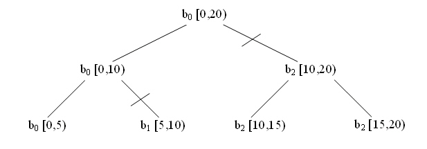
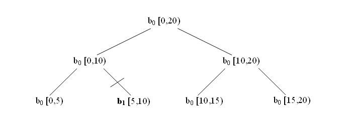

=================================
parallel_reduce Template Function
=================================

Summary
-------

Computes reduction over a range.

Header
------

.. code:: cpp

   #include "tbb/parallel_reduce.h"

Syntax
------

.. code:: cpp

   template<typename Range, typename Value, typename Func, typename Reduction>
   Value parallel_reduce( const Range& range, const Value& identity,
                          const Func& func, const Reduction& reduction,
                          [, partitioner[, task_group_context& group]] );
   
   template<typename Range, typename Body>
   void parallel_reduce( const Range& range, Body& body
                         [, partitioner[, task_group_context& group]] );

where the optional ``partitioner`` declares any of the partitioners as
shown in column 1 of the Partitioners table in the Partitioners section.

Description
-----------

The ``parallel_reduce`` template has two forms. The functional form is
designed to be easy to use in conjunction with lambda expressions. The imperative
form is designed to minimize copying of data.

The functional form ``parallel_reduce(range, identity, func, reduction)`` performs a parallel reduction by applying *func* to
subranges in range and reducing the results using binary operator
*reduction*. It returns the result of the reduction. Parameter *func* and
*reduction* can be lambda expressions. The table below summarizes the type
requirements on the types of *identity*, *func*, and *reduction*.

= ========================================================================================
\ Requirements for Func and Reduction: Pseudo-Signature, Semantics
==========================================================================================
\ ``Value identity``
  \
  Left identity element for ``Func::operator()``.
------------------------------------------------------------------------------------------
\ ``Value Func::operator()(const Range& range, const Value& x) const``
  \
  Accumulate result for subrange, starting with initial value
  ``x``.
------------------------------------------------------------------------------------------
\ ``Value Reduction::operator()(const Value& x, const Value& y) const``
  \
  Combine results ``x`` and ``y``.
------------------------------------------------------------------------------------------
= ========================================================================================

The imperative form ``parallel_reduce(range,body)``
performs parallel reduction of *body* over each value in *range*. Type
``Range`` must model the Range concept. The body must model the
requirements shown in the table below.

= ========================================================================================
\ Requirements for parallel_reduce Body: Pseudo-Signature, Semantics
==========================================================================================
\ ``Body::Body( Body&, split )``
  \
  Splitting constructor. Must be able to run concurrently with
  ``operator()`` and method ``join``.
------------------------------------------------------------------------------------------
\ ``Body::~Body()``
  \
  Destructor.
------------------------------------------------------------------------------------------
\ ``void Body::operator()(const Range& range)``
  \
  Accumulate result for subrange.
------------------------------------------------------------------------------------------
\ ``void Body::join( Body& rhs )``
  \
  Join results. The result in rhs should be merged into the result
  of ``this``.
------------------------------------------------------------------------------------------
= ========================================================================================

A ``parallel_reduce`` recursively splits the range into subranges to
the point such that ``is_divisible()`` is false for each subrange. A
``parallel_reduce`` uses the splitting constructor to make one or more
copies of the body for each thread. It may copy a body while the body’s
``operator()`` or method join runs concurrently. You are responsible for
ensuring the safety of such concurrency. In typical usage, the safety requires no
extra effort.

When worker threads are available, ``parallel_reduce`` invokes the
splitting constructor for the body. For each such split of the body, it invokes
method join in order to merge the results from the bodies. Define join to update
this to represent the accumulated result for this and rhs. The reduction operation
should be associative, but does not have to be commutative. For a noncommutative
operation *op*, "``left.join(right)``" should update
*left* to be the result of *left op right*.

A body is split only if the range is split, but the converse is not necessarily
so. The figure below diagrams a sample execution of
``parallel_reduce``. The root represents the original body
b\ :sub:`0` being applied to the half-open interval [0,20). The range is
recursively split at each level into two subranges. The grain size for the example
is 5, which yields four leaf ranges. The slash marks (/) denote where copies
(b\ :sub:`1` and b\ :sub:`2`) of the body were created by the body splitting
constructor. Bodies b\ :sub:`0` and b\ :sub:`1` each evaluate one leaf. Body
b\ :sub:`2` evaluates leaf [10,15) and [15,20), in that order. On the way back up
the tree, ``parallel_reduce`` invokes b\ :sub:`0`.join(b\ :sub:`1`)
and b\ :sub:`0`.join(b\ :sub:`2`) to merge the results of the leaves.

**Execution of parallel_reduce over blocked_range<int>(0,20,5)**

The figure above shows only one possible execution. Other valid executions include
splitting b\ :sub:`2` into b\ :sub:`2` and b\ :sub:`3`, or doing no splitting
at all. With no splitting, b\ :sub:`0` evaluates each leaf in left to right order,
with no calls to ``join``. A given body always evaluates one or more
subranges in left to right order. For example, in the figure above, body
b\ :sub:`2` is guaranteed to evaluate [10,15) before [15,20). You may rely on the
left to right property for a given instance of a body. However, you must neither
rely on a particular choice of body splitting nor on the subranges processed by a
given body object being consecutive. ``parallel_reduce`` makes the
choice of body splitting nondeterministically.

**Example where Body b0 processes non-consecutive subranges.**

The subranges evaluated by a given body are not consecutive if there is an
intervening ``join``. The joined information represents processing of a
gap between evaluated subranges. The figure above shows such an example. The body
b\ :sub:`0` performs the following sequence of operations:

* b\ :sub:`0`\ ( [0,5) )
* b\ :sub:`0`\ ``.join``\ ()( b\ :sub:`1` ) where b\ :sub:`1` has
  already processed [5,10)
* b\ :sub:`0`\ ( [10,15) )
* b\ :sub:`0`\ ( [15,20) )

In other words, body b\ :sub:`0` gathers information about all the leaf subranges
in left to right order, either by directly processing each leaf, or by a join
operation on a body that gathered information about one or more leaves in a similar
way. When no worker threads are available, ``parallel_reduce`` executes
sequentially from left to right in the same sense as for
``parallel_for``. Sequential execution never invokes the splitting
constructor or method join.

All overloads can be passed a ``task_group_context`` object so that the
algorithm’s tasks are executed in this group. By default the algorithm is executed
in a bound group of its own.

**Complexity**

If the range and body take *O(1)* space, and the range splits into nearly equal
pieces, then the space complexity is *O(P×log(N))*, where *N* is the
size of the range and P is the number of threads.

Example (Imperative Form)
-------------------------

The following code sums the values in an array.

.. code:: cpp

   #include "tbb/parallel_reduce.h"
   #include "tbb/blocked_range.h"
   
   using namespace tbb;
   
   struct Sum {
       float value;
       Sum() : value(0) {}
       Sum( Sum& s, split ) {value = 0;}
       void operator()( const blocked_range<float*>& r ) {
           float temp = value;
           for( float* a=r.begin(); a!=r.end(); ++a ) {
               temp += *a;
           }
           value = temp;
       }
       void join( Sum& rhs ) {value += rhs.value;}
   };
   
   float ParallelSum( float array[], size_t n ) {
       Sum total;
       parallel_reduce( blocked_range<float*>( array, array+n ),
                        total );
       return total.value;
   }

The example generalizes to reduction for any associative operation *op* as
follows:

* Replace occurrences of 0 with the identity element for *op*
* Replace occurrences of += with *op*\ = or its logical equivalent.
* Change the name ``Sum`` to something more appropriate for *op*.

The operation may be noncommutative. For example, *op* could be matrix
multiplication.

Example with Lambda Expressions
-------------------------------

The following is analogous to the previous example, but written using lambda
expressions and the functional form of ``parallel_reduce``.

.. code:: cpp

   #include "tbb/parallel_reduce.h"
   #include "tbb/blocked_range.h"
   
   using namespace tbb;
   
   float ParallelSum( float array[], size_t n ) {
       return parallel_reduce(
           blocked_range<float*>( array, array+n ),
           0.f,
           ->float {
               for( float* a=r.begin(); a!=r.end(); ++a )
                   init += *a;
               return init;
           },
           ->float {
               return x+y;
           }
       );
   }

STL generalized numeric operations and functions objects can be used to write the
example more compactly as follows:

.. code:: cpp

   #include <numeric>
   #include <functional>
   #include "tbb/parallel_reduce.h"
   #include "tbb/blocked_range.h"
   
   using namespace tbb;
   
   float ParallelSum( float array[], size_t n ) {
       return parallel_reduce(
           blocked_range<float*>( array, array+n ),
           0.f,
           ->float {
               return std::accumulate(r.begin(),r.end(),value);
           },
           std::plus<float>()
       );
   }
