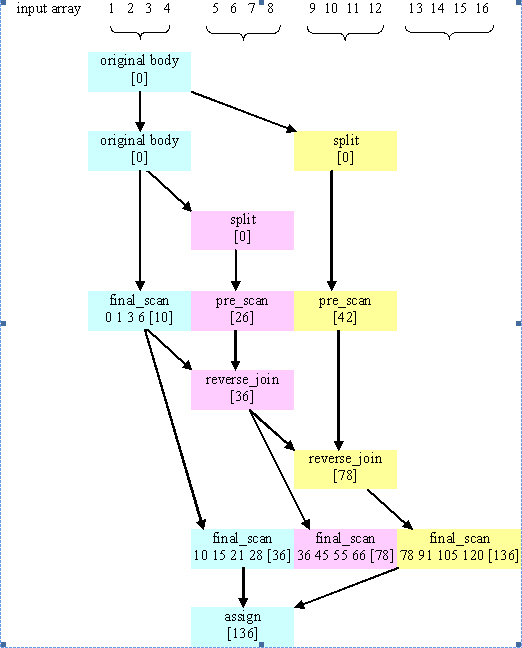

===============================
parallel_scan Template Function
===============================

Summary
-------
Template function that computes parallel prefix.

Header
------

.. code:: cpp

   #include "tbb/parallel_scan.h"

Syntax
------

.. code:: cpp

   template<typename Range, typename Body> 
   void parallel_scan( const Range& range, Body& body [, partitioner] );
   
   template<typename Range, typename Value, typename Scan, typename Combine>
   Value parallel_scan( const Range& range, const Value& identity,
                        const Scan& scan, const Combine& combine
                        [, partitioner] );

where the optional ``partitioner`` declares ``auto_partitioner`` 
or ``simple_partitioner``
as shown in column 1 of the Partitioners table in the Partitioners section.

Description
-----------

The ``parallel_scan`` template function
computes a parallel prefix, also known as parallel scan. This computation is an advanced concept
in parallel computing that is sometimes useful in scenarios that appear to have inherently
serial dependences.

A mathematical definition of the parallel prefix is as follows. Let
× be an associative operation with left-identity element id\ :sub:`×`. 
The parallel prefix of × over a sequence *z*\ :sub:`0`, *z*\ :sub:`1`, ...*z*\ :sub:`n-1` 
is a sequence *y*\ :sub:`0`, *y*\ :sub:`1`, *y*\ :sub:`2`, ...*y*\ :sub:`n-1` 
where:

* y\ :sub:`0` = id\ :sub:`×` × z\ :sub:`0`
* y\ :sub:`i` = y\ :sub:`i-1` × z\ :sub:`i`

For example, if × is addition, the parallel prefix corresponds a running sum. A
serial implementation of parallel prefix is::

   T temp = id×;
   for( int i=1; i<=n; ++i ) {
       temp = temp × z[i];
       y[i] = temp;
   }
       

Parallel prefix performs this in parallel by reassociating the application of × and using two
passes. It may invoke × up to twice as many times as the serial prefix algorithm. Even though
it does more work, given the right grain size the parallel algorithm can outperform the serial one
because it distributes the work across multiple hardware threads.
To obtain decent speedup, systems with more than two cores are recommended.

The ``parallel_scan`` template function has two forms.
The imperative form ``parallel_scan(range, body)`` implements parallel prefix
generically. Type ``Range`` must model the Range concept. The body must
model the requirements in the following table.

= ========================================================================================
\ Requirements for parallel_scan Body: Pseudo-Signature, Semantics
==========================================================================================
\ ``void Body::operator()( const Range& r, pre_scan_tag )``
  \
  Accumulate summary for range ``r``.
------------------------------------------------------------------------------------------
\ ``void Body::operator()( const Range& r, final_scan_tag )``
  \
  Compute scan result and summary for range ``r``.
------------------------------------------------------------------------------------------
\ ``Body::Body( Body& b, split )``
  \
  Split ``b`` so that ``this`` and ``b`` can
  accumulate summaries separately.
------------------------------------------------------------------------------------------
\ ``void Body::reverse_join( Body& b )``
  \
  Merge summary accumulated by ``b`` into summary accumulated by
  ``this``, where ``this`` was created earlier from ``b``
  by splitting constructor.
------------------------------------------------------------------------------------------
\ ``void Body::assign( Body& b )``
  \
  Assign summary of ``b`` to ``this``.
------------------------------------------------------------------------------------------
= ========================================================================================

A summary contains enough information such that for two consecutive subranges *r*
and *s*:

* If *r* has no preceding subrange, the scan result for *s* can be computed from
  knowing *s* and the summary for *r*.
* A summary of *r* concatenated with *s* can be computed from the summaries of *r*
  and *s*.

For example, if computing a running sum of an array, the summary for a range *r* is
the sum of the array elements corresponding to *r*.

The functional form ``parallel_scan(range, identity, scan, combine)`` is designed
to use with functors and lambda expressions, hiding some complexities of the imperative form.
It uses the same *scan* functor in both passes, differentiating them via a Boolean parameter,
combines summaries with *combine* functor, and returns the summary computed over the whole
*range*.
The table below summarizes the type requirements on the types of *identity*, *scan*,
and *combine*.

= ========================================================================================
\ Requirements for Scan and Combine: Pseudo-Signature, Semantics
==========================================================================================
\ ``Value identity``
  \
  Left identity element for ``Scan::operator()``.
------------------------------------------------------------------------------------------
\ ``Value Scan::operator()(const Range& r, const Value& sum, bool is_final) const``
  \
  Starting with ``sum``, compute the summary
  and, for ``is_final == true``, the scan result
  for range ``r``. Return the computed summary.
------------------------------------------------------------------------------------------
\ ``Value Combine::operator()(const Value& left, const Value& right) const``
  \
  Combine summaries ``left`` and ``right``,
  and return the result.
------------------------------------------------------------------------------------------
= ========================================================================================

The figure below shows one way that ``parallel_scan`` might compute the running
sum of an array containing the integers 1-16. Time flows downwards in the diagram. Each
color denotes a separate ``Body`` object. Summaries are shown in brackets.

* The first two steps split the original blue body into the pink and yellow bodies. Each body
  operates on a quarter of the input array in parallel. The last quarter is processed later in step 5.
* The blue body computes the final scan and summary for 1-4. The pink and yellow bodies compute 
  their summaries by prescanning 5-8 and 9-12 respectively.
* The pink body computes its summary for 1-8 by performing a reverse_join with the blue body.
* The yellow body computes its summary for 1-12 by performing a reverse_join with the pink body.
* The blue, pink, and yellow bodies compute final scans and summaries for portions of the array.
* The yellow summary is assigned to the blue body. The pink and yellow bodies are destroyed.

Note that two quarters of the array were not prescanned. The ``parallel_scan`` template 
makes an effort to avoid prescanning where possible, to improve performance when there are only a few 
or no extra worker threads. If no other workers are available, ``parallel_scan`` processes 
the subranges without any pre_scans, by processing the subranges from left to right using final scans. 
That's why final scans must compute a summary as well as the final scan result. The summary might be 
needed to process the next subrange if no worker thread has prescanned it yet.

**Example Execution of parallel_scan**

Example (Imperative Form)
-------------------------

The following code demonstrates how Body could be implemented for ``parallel_scan`` 
to compute the same result as the earlier sequential example involving ×::

   class Body {
       T sum;
       T* const y;
       const T* const z;
   public:
       Body( T y_[], const T z_[] ) : sum(id×), z(z_), y(y_) {}
       T get_sum() const { return sum; }
   
       template<typename Tag>
       void operator()( const tbb::blocked_range<int>& r, Tag ) {
           T temp = sum;
           for( int i=r.begin(); i<r.end(); ++i ) {
               temp = temp × z[i];
               if( Tag::is_final_scan() )
                   y[i] = temp;
           }
           sum = temp;
       }
       Body( Body& b, tbb::split ) : z(b.z), y(b.y), sum(id×) {}
       void reverse_join( Body& a ) { sum = a.sum × sum; }
       void assign( Body& b ) { sum = b.sum; }
   };
   
   T DoParallelScan( T y[], const T z[], int n ) {
       Body body(y,z);
       tbb::parallel_scan( tbb::blocked_range<int>(0,n), body );
       return body.get_sum();
   }
       

The definition of ``operator()`` demonstrates typical patterns when using
``parallel_scan``.

* A single template defines both versions. Doing so is not required, but usually saves coding
  effort, because the two versions are usually similar. The library defines static method
  ``is_final_scan(``) to enable differentiation between the versions.
* The prescan variant computes the × reduction, but does not update ``y``. 
  The prescan is used by ``parallel_scan`` to generate look-ahead partial reductions.
* The final scan variant computes the × reduction and updates ``y``.

The operation ``reverse_join`` is similar to the operation ``join`` 
used by ``parallel_reduce``, except that the arguments are reversed. 
That is, ``this`` is the *right* argument of ×. Template function 
``parallel_scan`` decides if and when to generate parallel work.
It is thus crucial that × is associative and that the methods of Body faithfully represent it.
Operations such as floating-point addition that are somewhat associative can be used, with the
understanding that the results may be rounded differently depending upon the association used by
``parallel_scan``. The reassociation may differ between runs even on the same
machine. However, if there are no worker threads available, execution associates identically to
the serial form shown at the beginning of this section.

If you change the example to use a ``simple_partitioner``, be sure to provide a grain size. 
The code below shows the how to do this for the grain size of 1000:

.. code:: cpp

   parallel_scan(blocked_range<int>(0,n,1000), total, simple_partitioner() );
       

Example with Lambda Expressions
-------------------------------

The following is analogous to the previous example, but written using lambda expressions and the functional form of parallel_scan::

   T DoParallelScan( T y[], const T z[], int n ) {
       return tbb::parallel_scan( 
           tbb::blocked_range<int>(0,n), 
           id×, 
           ->T {
               T temp = sum;
               for( int i=r.begin(); i<r.end(); ++i ) {
                   temp = temp × z[i];
                   if( is_final_scan )
                       y[i] = temp;
               }
               return temp;
           },
            {
               return left × right;
           }
       );
   }
       

See also:

* :doc:`pre_scan_tag and final_scan_tag Classes <parallel_scan_func/pre_scan_tag_and_final_scan_tag_clses>`

.. toctree::

   parallel_scan_func/pre_scan_tag_and_final_scan_tag_clses.rst
