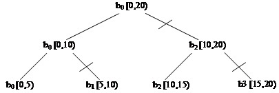

===============================================
parallel_deterministic_reduce Template Function
===============================================

Summary
-------

Computes reduction over a range, with deterministic
split/join behavior.

Header
------

.. code:: cpp

   #include "tbb/parallel_reduce.h"

Syntax
------

.. code:: cpp

   template<typename Range, typename Value, typename Func, typename Reduction>
   Value parallel_deterministic_reduce( const Range& range, const Value& identity,
                                        const Func& func, const Reduction& reduction,
                                        [, partitioner [, task_group_context& group]] );
   
   template<typename Range, typename Body>
   void parallel_deterministic_reduce( const Range& range, const Body& body
                                       [, partitioner [, task_group_context& group]] );

where the optional ``partitioner`` declares
``simple_partitioner``
or ``static_partitioner``
as shown in column 1 of the Partitioners table in the Partitioners section.

Description
-----------

The
``parallel_deterministic_reduce`` template
is very similar to the
``parallel_reduce``
template. It also has the functional and imperative forms and has similar
requirements for Func and Reduction.

Unlike
``parallel_reduce``,
``parallel_deterministic_reduce`` has
deterministic behavior with regard to splits of both Body and Range and joins
of the bodies. For the functional form, Func is applied to a deterministic set
of Ranges, and Reduction merges partial results in a deterministic order. To
achieve that,
``parallel_deterministic_reduce``
uses a ``simple_partitioner``
or a ``static_partitioner`` only
because other partitioners react to random work stealing behavior.

.. caution::

   Since ``simple_partitioner``
   does not automatically coarsen ranges, make sure to specify an appropriate grain size.
   See Partitioners section for more information.

``parallel_deterministic_reduce`` always
invokes the Body splitting constructor for each range split.

   Execution of parallel_deterministic_reduce over blocked_range<int>(0,20,5)

As a result,
``parallel_deterministic_reduce``
recursively splits a range until it is no longer divisible, and creates a new
body (by calling Body splitting constructor) for each new subrange. Like
``parallel_reduce``, for
each body split the method
``join`` is invoked in order to merge the results from the
bodies. The figure above shows the execution of
``parallel_deterministic_reduce`` over a
sample range, with the slash marks (/) denoting where new instances of the body
were created.

Therefore for given arguments,
``parallel_deterministic_reduce``
executes the same set of split and join operations no matter how many threads
participate in execution and how tasks are mapped to the threads.
If the user-provided functions are also deterministic (i.e. different runs
with the same input result in the same output), then multiple calls to
``parallel_deterministic_reduce``
will produce the same result. Note however that the result might differ
from that obtained with an equivalent sequential (linear) algorithm.

**Complexity**

If the range and body take O(1) space, and the
range splits into nearly equal pieces, then the space complexity is O(P
log(N)), where N is the size of the range and P is the number of threads.

Example
-------

Modifying a program to use
``parallel_deterministic_reduce``
instead of ``parallel_reduce``
can be done in a few steps. First, change the function name. Then, if the used
partitioner is not supported by ``parallel_deterministic_reduce``,
change the partitioner. Last, if you notice performance degradation, a grain size
for ``blocked_range`` may need to be specified or adjusted.

The example below is taken from
*parallel_reduce Template Function* section and modified to use
``parallel_deterministic_reduce``.

.. code:: cpp

   #include <numeric>
   #include <functional>
   #include "tbb/parallel_reduce.h"
   #include "tbb/blocked_range.h"
   
   float ParallelSum( float array[], size_t n ) {
       size_t grain_size = 1000;
       return tbb::parallel_deterministic_reduce(
           tbb::blocked_range<float*>( array, array+n, grain_size[ ),
           0.f,
           ->float {
               return std::accumulate(r.begin(),r.end(),value);
           },
           std::plus<float>());
   }

See also:

* :doc:`simple_partitioner Class <partitioners/simple_partitioner_cls>`
* :doc:`Partitioners <partitioners>`
* :doc:`parallel_reduce Template Function <parallel_reduce_func>`
