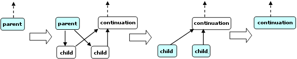
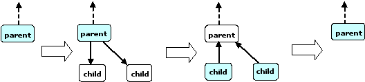

==============
Task Scheduler
==============

oneAPI Threading Building Blocks 
provides a task scheduler, which is the engine that drives the algorithm
templates and task groups. You may also call it directly. Using tasks is often
simpler and more efficient than using threads, because the task scheduler takes
care of a lot of details.

The tasks are quanta of computation. The scheduler
maps these onto physical threads. The mapping is non-preemptive. Each task
has a method ``execute()``. Once a thread starts running 
``execute()``, the task is bound to that thread until 
``execute()`` returns. During that time, the thread services
other tasks only when it waits for completion of child tasks or nested
parallel constructs, as described below. While waiting, it may run any available
task, including unrelated tasks created by this or other threads.

The task scheduler is intended for parallelizing
computationally intensive work. Because task objects are not scheduled preemptively,
they should generally avoid making calls that might block a thread for long periods
during which the thread cannot service other tasks.

.. caution::

   There is no guarantee that
   *potentially* parallel tasks
   *actually* execute in parallel, because the scheduler adjusts
   actual parallelism to fit available worker threads. For example, given a single
   worker thread, the scheduler creates no actual parallelism. For example, it is
   generally unsafe to use tasks in a producer consumer relationship, because
   there is no guarantee that the consumer runs at all while the producer is
   running.

Potential parallelism is typically generated by a
*split/join* pattern. Two basic patterns of split/join are
supported. The most efficient is continuation-passing form, in which the
programmer constructs an explicit "continuation" task. The parent task creates
child tasks and specifies a continuation task to be executed when the children
complete. The continuation inherits the parent's ancestor. The parent task then
exits; it does not block on its children. The children subsequently run, and
after they (or their continuations) finish, the continuation task starts
running. The figure, "Continuation-passing Style," shows the steps. The running
tasks at each step are shaded.

   Continuation-passing Style

Explicit continuation passing is efficient, because
it decouples the thread's stack from the tasks. However, it is more difficult
to program. A second pattern is "blocking style", which uses implicit
continuations. It is sometimes less efficient in performance, but more
convenient to program. In this pattern, the parent task blocks until its
children complete, as shown in the figure below.

   Blocking Style

The convenience comes with a price. While the blocked parent task
remains in the stack, the thread can steal and run another task. Continually stealing
and blocking could cause the stack to grow without bound. To solve this problem,
the scheduler may constrain a blocked thread such that it stops stealing.
This constraint limits available parallelism and may impact performance.

High-level TBB constructs built on top of the task scheduler,
such as parallel algorithms and flow graphs, use continuation passing for recursive
parallelism and blocking for completion of the whole parallel construct.

See also:

* :doc:`Algorithms <algorithms>`
* :doc:`Task Groups <task_scheduler/task_groups>`
* :doc:`Flow Graph <flow_graph>`

.. toctree::

   low_level_tasking/scheduling_algorithm.rst
   low_level_tasking/task_cls.rst
   low_level_tasking/empty_task_cls.rst
   low_level_tasking/task_list_cls.rst
   low_level_tasking/catalog_of_recommended_task_patterns.rst
