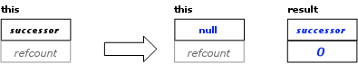

==========
task Class
==========

Summary
-------

Base class for tasks.

Syntax
------

.. code:: cpp

   class task;

Header
------

``#include "tbb/task.h"``

Description
-----------

Class task is the base class for tasks. You are
expected to derive classes from task, and at least override the virtual method 
``task* task::execute()``.

Each instance of 
``task`` has associated attributes, that while not
directly visible, must be understood to fully grasp how task objects are used.
The attributes are described in the table below.

= ========================================================================================
\ Task Attributes: Attribute, Description
==========================================================================================
\ ``successor``
  \
  Either null, or a pointer to another task
  whose refcount field will be decremented after the present task completes.
  Typically, the successor is the task that allocated the present task, or a task
  allocated as the continuation of that task.
  
  Methods of class 
  ``task`` call the successor "parent" and its
  preceding task the "child", because this was a common use case. But the library
  has evolved such that a child-parent relationship is no longer required between
  the predecessor and successor.
------------------------------------------------------------------------------------------
\ ``refcount``
  \
  The number of Tasks that have this as their
  parent. Increments and decrement of refcount are always atomic.
------------------------------------------------------------------------------------------
= ========================================================================================

.. tip::

   Always allocate memory for 
   ``task`` objects using special overloaded new operators
   provided by the library, otherwise the results are undefined. Destruction of a 
   ``task`` is normally implicit. The copy constructor and
   assignment operators for task are not accessible. This prevents accidental
   copying of a task, which would be ill-defined and corrupt internal data
   structures.

Notation
--------

Some member descriptions illustrate effects by
diagrams such as in the figure below.

   Example Effect Diagram

Conventions in these diagrams are as follows:

* The big arrow denotes the transition from the
  old state to the new state.
* Each task's state is shown as a box divided
  into 
  *parent* and 
  *refcount* sub-boxes.
* Gray denotes state that is ignored. Sometimes
  ignored state is left blank.
* Black denotes state that is read.
* Blue denotes state that is written.

Members
-------

In the description below, types 
*proxy1...proxy5* are internal types. Methods returning such types
should only be used in conjunction with the special overloaded new operators,
as described in Section task Allocation.

.. code:: cpp

   namespace tbb {
           class task {
           protected:
               task();
        
           public:
               virtual ~task() {}
        
               virtual task* execute() = 0;
        
               // Allocation
               static proxy1 allocate_root();
               static proxy2 allocate_root( task_group_context& );
               proxy3 allocate_continuation();
               proxy4 allocate_child();
               static proxy5 allocate_additional_child_of( task& );
        
               // Explicit destruction
               static void destroy( task& victim );
        
               // Recycling
               void recycle_as_continuation();
               void recycle_as_safe_continuation();
               void recycle_as_child_of( task& new_parent );
        
               // Synchronization
               void set_ref_count( int count );
               void increment_ref_count();
               int add_ref_count( int count );
               int decrement_ref_count();
               void wait_for_all();
               static void spawn( task& t );
               static void spawn( task_list& list );
               void spawn_and_wait_for_all( task& t );  
               void spawn_and_wait_for_all( task_list& list );  
               static void spawn_root_and_wait( task& root );
               static void spawn_root_and_wait( task_list& root );
               static void enqueue( task& );
               static void enqueue( task&, task_arena&[, priority_t ]);
        
               // Task context
               static task& self();
               task* parent() const;
               void set_parent( task *p );
               bool is_stolen_task() const;
               task_group_context* group();
               void change_group( task_group_context& ctx );
        
               // Cancellation
               bool cancel_group_execution();
               bool is_cancelled() const;
        
               // Priority
               static void enqueue( task&, priority_t );
               void set_group_priority ( priority_t );
               priority_t group_priority () const;
        
               // Affinity
               typedef implementation-defined-unsigned-type affinity_id;
               virtual void note_affinity( affinity_id id );
               void set_affinity( affinity_id id );
               affinity_id affinity() const;
        
               // Debugging
               enum state_type {
                   executing,
                   reexecute,
                   ready,
                   allocated,
                   freed
               };
               int ref_count() const;
               state_type state() const;
           };
       } // namespace tbb
        
       void *operator new( size_t bytes, const proxy1& p );
       void operator delete( void* task, const proxy1& p );
       void *operator new( size_t bytes, const proxy2& p );
       void operator delete( void* task, const proxy2& p );
       void *operator new( size_t bytes, const proxy3& p );
       void operator delete( void* task, const proxy3& p );
       void *operator new( size_t bytes, proxy4& p );
       void operator delete( void* task, proxy4& p );
       void *operator new( size_t bytes, proxy5& p );
       void operator delete( void* task, proxy5& p );

.. toctree::

   task_cls/task_derivation.rst
   task_cls/task_allocation.rst
   task_cls/explicit_task_destruction.rst
   task_cls/recycling_tasks.rst
   task_cls/synchronization_task.rst
   task_cls/task_context.rst
   task_cls/cancellation.rst
   task_cls/affinity.rst
   task_cls/task_debugging.rst
