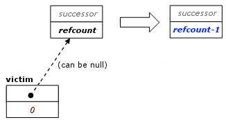

=========================
Explicit task Destruction
=========================

Usually, a 
``task`` is automatically destroyed by the scheduler after
its method 
``execute`` returns. But sometimes 
``task`` objects are used idiomatically (such as for
reference counting) without ever running  
``execute``. Such tasks should be disposed with method 
``destroy``.

static void destroy ( task& victim )
------------------------------------

**Requirements**

The refcount of 
``victim`` must be zero. This requirement is checked in
the debug version of the library.

**Effects**

Calls destructor and deallocates memory for 
``victim``. If 
``victim``.``parent`` is not
null, atomically decrements 
``victim.parent->refcount``. The parent is 
**not** put into the ready pool if its 
*refcount* becomes zero. The figure below summarizes the state
transition.

   Effect of destroy(victim).

``refcount`` adjustment is skipped if parent is
null.