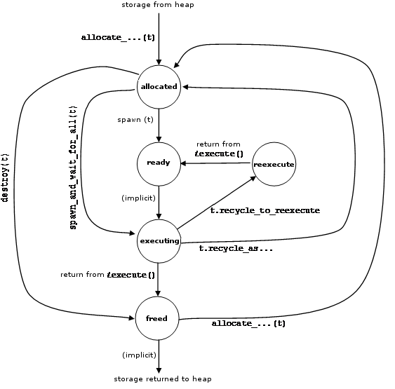

==============
task Debugging
==============

Methods in this subsection are useful for
debugging. They may change in future implementations.

state_type state() const
------------------------

.. caution::

   This method is intended for debugging only. Its
   behavior or performance may change in future implementations. The definition
   of ``task::state_type`` may change in future implementations. This
   information is being provided because it can be useful for diagnosing problems
   during debugging.

**Returns**

Current state of the task. The table below
describes valid states. Any other value is the result of memory corruption,
such as using a task whose memory has been deallocated.

.. table:: Values Returned by task::state()

   ========= ==============================
   Value     Description
   ========= ==============================
   allocated Task is freshly allocated or recycled.
   --------- ------------------------------
   ready     Task is in ready pool, or is in process of
             being transferred to/from there.
   --------- ------------------------------
   executing Task is running, and will be destroyed
             after method execute() returns.
   --------- ------------------------------
   freed     Task is on internal free list, or is in
             process of being transferred to/from there.
   --------- ------------------------------
   reexecute Task is running, and will be respawned
             after method execute() returns.
   ========= ==============================

The figure below summarizes possible state
transitions for a 
``task``.

   Typical task::state() Transitions

int ref_count() const
---------------------

.. caution::

   This method is intended for debugging only. Its
   behavior or performance may change in future implementations.

**Returns**

The value of the attribute 
*refcount*.