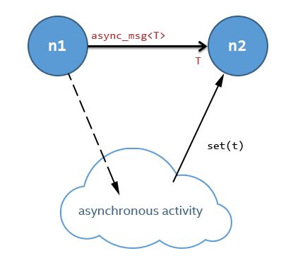
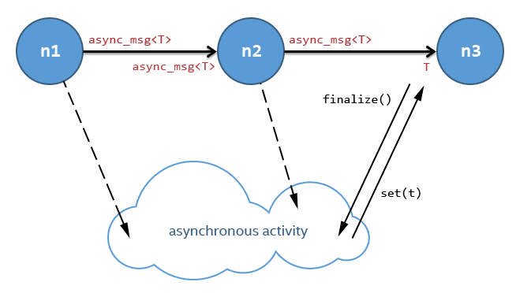

========================
async_msg Template Class
========================

Summary
-------

``async_msg`` is a special message class used to implement intercommunication
between an oneAPI Threading Building Blocks flow graph and an external parallel
activity, such as a thread or a device.

Syntax
------

.. code:: cpp

   template < typename T >
   class async_msg;

Header
------

.. code:: cpp

   #define TBB_PREVIEW_FLOW_GRAPH_FEATURES 1
   #include "tbb/flow_graph.h"

Description
-----------

An ``async_msg``, or a user type derived from ``async_msg``,
acts like a "future" that is specially handled by flow graph nodes.
An ``async_msg<T>`` is a representation of an asynchronous job result
of type ``T`` that can be processed by the graph while the result is not
ready yet. The result can be provided by the asynchronous activity with the
``async_msg<T>::set( T result )`` method at any moment.
Other classes can inherit from ``async_msg<T>`` to
create advanced async messages with additional data. Ports and nodes  that accept
messages of type ``T`` and async messages can both receive async messages
and can be connected with the ``make_edge`` interface, but handle them
differently.
If the node accepts an async message, it will react to an incoming async message immediately,
for example by passing the message directly to its body. However, if the node accepts the
result type ``T``, the virtual method
``async_msg<T>::finalize()`` will be called and the node will wait
for the result availability. The ``async_msg<T>::finalize()`` method
can be overridden in a derived async message type, e.g. to notify the asynchronous
activity that a result is required and/or to set a callback.

.. caution::

   The method ``async_msg<T>::set( T result )`` must be called
   at most once. If the async message is never passed to a node that accepts the
   results of asynchronous activity than the result can be never set.
   However, if the async message is passed to a node that accepts the result of
   async message (the ``finalize()`` method will be called in this case),
   the result must be set.

.. note::

   If a node accepts an async message, but a message of result type
   ``T`` is provided to the node, an async message will be automatically
   created and the incoming message of type ``T`` will be immediately
   set as its result.

.. note::

   Nodes or ports that accepts async messages can accept only an async message of the
   same type or a message of the result type. Therefore, it is impossible to pass
   ``async_msg<T>`` to a node that accepts async messages of
   derived type from ``async_msg<T>``.

.. note::

   The current implementation can call the ``async_msg<T>::finalize()``
   method many times and does not call the method if the result has been previously set.
   However, this behavior can be changed in future releases.

The ``graph::wait_for_all()`` method waits until the results are ready for all
async messages created and consumed by nodes of the graph. However if async messages
are created and send to the graph by an external activity, it must use
``increment_ref_count()`` and ``decrement_ref_count()`` methods
to prevent completion of the graph before it sends all the async messages. Once an async message
is sent to the graph, ``wait_for_all()`` will wait for its result to be ready.

The simplest usage scenario of the ``async_msg`` is shown in the figure
below: the left flow graph node (n1) starts an asynchronous activity in its body and
returns an ``async_msg`` object without waiting for the result to be set.
The next node (n2) automatically receives the ready result when it’s set by the
asynchronous activity through its copy of the ``async_msg``.

The simplest scenario steps are described below:

* A ``function_node`` n1 creates an instance of ``async_msg<T>``.
* n1 sends work to an external asynchronous activity along with a copy of the ``async_msg``.
* n1 puts ``async_msg<T>`` to its successor.
* The external asynchronous activity returns the result back to the flow graph by calling the
  method ``set(result)`` in the ``async_msg`` instance obtained in the step 2.
* The successor node gets the data of type ``T`` as usual.

   The simplest scenario with the async_msg.

In this scenario, ``async_msg`` and ``function_node`` together
provide behavior very similar to the ``async_node`` class.

The main advantage of ``async_msg`` over the ``async_node`` is
the ability to pass such a message through the flow graph unmodified or even updated,
as in the following usage scenario:

* A ``function_node`` n1 creates an instance of ``async_msg<T>``.
* n1 sends work to an external asynchronous activity, along with a copy of the ``async_msg``.
* n1 puts ``async_msg<T>`` to the next node n2.
* n2 sends the second part of work to an external asynchronous activity.
  It can update the ``async_msg`` message instance if it’s needed.
* When the ``async_msg<T>`` comes to the final node (receiving
  type ``T``) in the graph, its virtual method ``finalize()``
  is automatically called by the library. This method might be overridden in custom
  asynchronous messages. Its intended use is to set a callback for the asynchronous
  activity to return its result to the flow graph.
  
  .. note::

     ``async_msg<T>::finalize()`` may be called a few times by the library,
     but the method will never be called after the ``set()`` method has been
     invoked on the ``async_msg``.
  
* The next node n3 gets the ``UserDataType`` data as usual.

   The scenario with a processing chain.
        

.. note::

   Usually the first node in the processing chain uploads data to the external asynchronous
   activity (thread or device). The next nodes in the chain can continue the data processing
   without any additional data uploading and downloading. And only the last node in the chain
   will get the activity result.

Any user class derived from ``async_msg`` can be used in the use-cases above.
For example, a derived asynchronous message class may be implemented that stores or updates
additional states or flags while the data processing chain is working.

Example
-------

The example below shows a ``source_node`` that submits some work to
``AsyncActivity`` for processing by a user thread. An ``async_msg``
is used to communicate the result to a downstream ``function_node``.

.. code:: cpp

   #define TBB_PREVIEW_FLOW_GRAPH_FEATURES 1
   
   #include <thread>
   #include <atomic>
   #include "tbb/flow_graph.h"
   #include "tbb/concurrent_queue.h"
   
   using namespace tbb::flow;
   typedef int input_type;
   typedef int output_type;
   typedef tbb::flow::async_msg<output_type> async_msg_type;
   
   
   class AsyncActivity {
   public:
       struct work_type {
           input_type input;
           async_msg_type msg;
       };
   
       AsyncActivity() : my_the_end(false), service_thread( [this]() {
           work_type w;
           while( ! my_the_end ) {
               while( my_work_queue.try_pop(w) ) {
                   output_type result = do_work( w.input );
                   //send the result back to the graph
                   w.msg.set(result);
               }
           }
       } ) {}
   
       ~AsyncActivity() {
           my_the_end = true; // indicates that the thread should exit
           service_thread.join();
       }
   
       void submit( input_type i, const async_msg_type& msg ) {
           work_type w = {i, msg};
           my_work_queue.push(w);
       }
   
   private:
       output_type do_work(input_type& v) {
           // performs the work on input converting it to output
       }
   
       tbb::concurrent_queue<work_type> my_work_queue;
       std::atomic<bool> my_the_end;
   
       std::thread service_thread;
   };
   
   int main() {
       tbb::flow::graph g;
       AsyncActivity async_activity;
   
      tbb::flow::source_node<async_msg_type> s(g, [&](async_msg_type& v)->bool {
          /* produce data for async work */
          if ( /* source is not over */ ) {
              async_msg_type msg;
              /* generate "input" here */
              async_activity.submit(input, msg);
              v = msg;
              return true;
          }
      
          return false;
      });
   
       tbb::flow::function_node<output_type> f( g, unlimited,  
       { /* consume data from async work */ });
   
       tbb::flow::make_edge( s, f );
       g.wait_for_all();
       return 0;
   }

Members
-------

.. code:: cpp

     
   namespace tbb {
       namespace flow {
   
           template <typename T>
           class async_msg {
           public:
               typedef T async_msg_data_type;
   
               async_msg();
               virtual ~async_msg() {}
   
               void set(const T& t);
               void set(T&& t);
   
           protected:
               // Can be overridden in derived class to inform that 
               // async calculation chain is over
               virtual void finalize() const {}
           };
   
       }
   }

The following table provides additional information on the members of this template class.

= ========================================================================================
\ Member, Description
==========================================================================================
\ ``typedef T async_msg_data_type``
  \
  User data type definition.
------------------------------------------------------------------------------------------
\ ``async_msg()``
  \
  Default constructor.
------------------------------------------------------------------------------------------
\ ``async_msg(const async_msg&)``
  \
  Auto-generated copy constructor.
------------------------------------------------------------------------------------------
\ ``~async_msg()``
  \
  Destructor.
------------------------------------------------------------------------------------------
\ ``void set(const T& t)``
  \
  Call the method to return a result from the asynchronous activity back to the flow graph.
  
  .. note::

     ``set()`` must be called once only per ``async_msg``.
  
------------------------------------------------------------------------------------------
\ ``void set(T&& t)``
  \
  The same as the previous ``set(const T&)`` method but using C++ 'move' semantics.
------------------------------------------------------------------------------------------
\ ``async_msg& operator = (const async_msg&)``
  \
  Auto-generated assignment operator.
------------------------------------------------------------------------------------------
= ========================================================================================

= ========================================================================================
\ PROTECTED, 
==========================================================================================
\ ``virtual void finalize() const``
  \
  Override the method in the derived class to inform the asynchronous activity
  that the data handling chain is over and the activity should return the result
  (via the ``set()`` call).
  
  .. note::

     An asynchronous activity can call the ``set()`` method at any time,
     but the ``finalize()`` synchronization call allows it to wait until
     there is at least one node waiting for the result in the flow graph.
  
  
  Default implementation is empty.
------------------------------------------------------------------------------------------
= ========================================================================================

.. caution::

   The ``async_msg`` class is copyable, so the user must provide correct
   copy routines in any derived class.

See also:

* :doc:`async_node <../../flow_graph/async_node_cls>`
