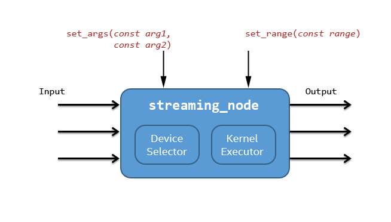
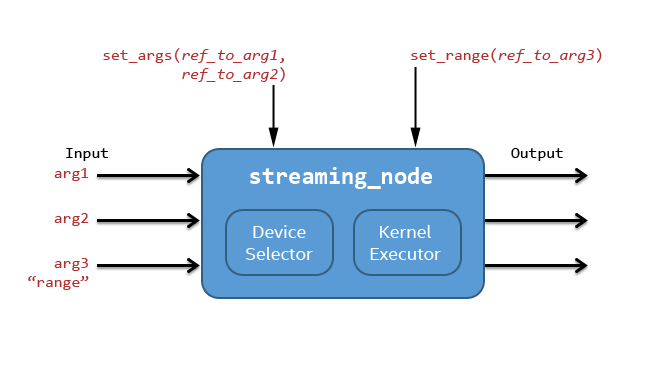

=============================
streaming_node Template Class
=============================

Summary
-------

``streaming_node`` enables the use of streaming programming models that support
submission of kernels and data to devices through queues. The class ``streaming_node``
provides the interfaces that are needed to easily integrate the use of such models into a flow graph,
allowing developers to use a graph to coordinate functions that execute on different devices or
hardware resources in a heterogeneous platform. You must define the low-level details of an actual
model being used by providing a Factory to the ``streaming_node``.

:doc:`opencl_node <opencl_node_cls>`
is an example of a model-specific ``streaming_node`` that enables OpenCL* powered
devices to be utilized and coordinated by a Flow Graph. Developers may also define custom factories
to support different modules.

The use of ``streaming_node`` requires C++11 support.

Syntax
------

.. code:: cpp

   template < typename... Args >
   class streaming_node;
   template < typename... Ports, typename JP, typename Factory >
   class streaming_node < tuple < Ports... >, JP, Factory >;

Header
------

.. code:: cpp

   #define TBB_PREVIEW_FLOW_GRAPH_FEATURES 1
   #include "tbb/flow_graph.h"

Description
-----------

The class ``streaming_node`` is a part of a larger flow graph based solution
to support heterogeneous computing devices.

The terms used in this section are defined below.

===============  ==============================
Term             Definition
===============  ==============================
Factory          A concept that provides interfaces to upload input data to the device,
  \              run a kernel on the device and to provide all needed types.
---------------  ------------------------------
Device           A compute resource capable of executing a kernel.
---------------  ------------------------------
Kernel           The compute function to be executed on the device.
---------------  ------------------------------
Kernel Argument  The data that must be provided to the device in order to execute the kernel.
  \              Arguments may be input, output or both.
---------------  ------------------------------
Kernel Range     The calculation range for a single kernel execution.
===============  ==============================

There are several basic principles in the ``streaming_node`` usage model:

* Device specifics are not directly embedded in a ``streaming_node``,
  but are instead accessed through a Factory.
* A ``streaming_node`` receives input data through its set of input ports.
  
  * The input data may be used as kernel arguments, the kernel range, or may pass through
    unmodified to an output port.
  * Depending on the Factory implementation, input messages that are derived from
    ``async_msg`` may be treated specially to enable asynchronous execution.
  
* For each input port, there is a corresponding output port.
  
  * All output messages are wrapped in Factory-defined ``async_msg`` types
    to enable asynchronous execution.
  * The availability of an output message does not mean that the underlying result data is
    ready because all output messages are derived from ``async_msg``
    (see ``async_msg``).
  * If the input from any port is not referenced by a kernel argument or the kernel range,
    the input data will pass through unchanged to its matching output port.
  
* While you are creating and setting up a ``streaming_node``, you can specify:
  
  * Model specifics (through the Factory object)
  * A device selecting logic (through a ``DeviceSelector`` object)
  * The kernel arguments as constants or as mapped from specific input ports
  * Optionally, the kernel range as a constant or as mapped from a specific input port
  

   A diagram of a streaming_node is shown below:

The node can read the kernel arguments (and the optional kernel range)
from the input ports. Or you can define the kernel arguments (and the range)
once before using the node.

The output data may not be ready immediately at the end of the node execution, so output ports
always send messages that are derived from ``async_msg``.
However the capabilities of the ``async_msg`` class ensure that other flow graph
nodes properly respond to these messages and do not try to use the data before it is available
(see ``async_msg``).

The simplified ``streaming_node`` algorithm can be described as the following series
of actions:

* Receive input data at the input ports. If not already wrapped in the Factory-specific
  ``async_msg`` type, wrap the inputs.
* Select a device for the kernel execution.
* Send the kernel arguments and, optionally, the kernel range to the device.
* Enqueue the kernel for execution on the device.
* Update the dependencies in the ``async_msgs`` as needed.
* Send the updated ``async_msgs`` through the output ports as the node output.

.. note::

   A ``streaming_node`` always sends out ``async_msg_type`` values to
   the next nodes. It does NOT wait for the end of the kernel execution. The waiting is postponed
   to the point of real result data processing, like in the general C++ future-promise concept.
   (See description of the ``async_msg`` class for details.)

.. note::

   The node assumes that all kernel arguments may be modified by the execution of a kernel in the
   factory. This assumption may unnecessarily delay the availability of the data in read-only arguments
   in the output ``async_msgs``.

Factory Concept
---------------

**Summary**

The ``streaming_node`` is an abstract execution mechanism that communicates
with a particular device through a factory object. The Factory provides the means
to upload input data to the device, run a kernel on the device and to provide a set of
needed by the node types.

**Requirements**

The following table lists the requirements for a Factory type ``F``.

= ========================================================================================
\ Factory Concept: Pseudo-Signature, Semantics
==========================================================================================
\ ``template <typename T> using F::async_msg_type = .....;``
  \
  Device specific type: async message type (derived from ``async_msg`` class).
------------------------------------------------------------------------------------------
\ ``typedef ..... F::device_type;``
  \
  Device specific type: target device type.
------------------------------------------------------------------------------------------
\ ``typedef ..... F::kernel_type;``
  \
  Device specific type: device kernel type.
------------------------------------------------------------------------------------------
\ ``typedef ..... F::range_type;``
  \
  **Optional**. Device specific type: range type.
------------------------------------------------------------------------------------------
\ ``template <typename ...Args> void F::send_kernel(device_type device, const kernel_type& kernel, [const range_type& work_size,] Args&... args)``
  \
  Run kernel on the device.
------------------------------------------------------------------------------------------
\ ``template <typename ...Args> void F::send_data(device_type device, Args&... args)``
  \
  Upload data to the device.
------------------------------------------------------------------------------------------
\ ``template <typename FinalizeFn, typename ...Args> void F::finalize(device_type device, FinalizeFn fn, Args&... args)``
  \
  Finalization action after the kernel run.
  
  The functor ``fn`` must be called after the end of the kernel execution.
------------------------------------------------------------------------------------------
= ========================================================================================

If the Factory supports the range concept, the type ``range_type`` must be defined.
In this case, ``streaming_node`` provides a set of methods to define the range.
If kernel ranges are not supported by the Factory, these methods are unavailable.

If a kernel range is not supported, the ``send_kernel`` interface is as follows:

.. code:: cpp

   template <typename ...Args>
   void F::send_kernel(device_type device, const kernel_type& kernel, Args&... args)

**Description**

The streaming node calls the method **send_kernel** to start the kernel
on the specified external device. All incoming arguments (``Args&... args``) are
provided as references to the ``async_msg_type`` type. The references are constant
if the arguments were set by values via **set_args** or a non-constant
if the arguments are dynamic values from input ports; that is, was set originally via a
``port_ref`` arguments of the **set_args** method.

The method **send_data** is called by the streaming node to upload original
kernel arguments to the specified device. All incoming arguments ``Args&... args``
are provided as references to the ``async_msg_type`` type. The list includes only values
that were set via **set_args** by value (not as a ``port_ref``).

The method **finalize** is called by the streaming node to let the factory set a
callback for the graph to notify the graph that the kernel execution is finished. In this case the
factory must call the provided finalization functor. Note that the method **finalize**
will be called by the node only if the following graph nodes rejected this node output messages
or if the node output ports are **not** connected with a node (so, nothing in the graph
will wait for the kernel results). The incoming arguments ``Args&... args`` are
provided as either constant or non-constant references to the ``async_msg_type`` type as
in the method **send_kernel**.

Device Selector Concept
-----------------------

**Summary**

The ``Device Selector`` object is a simple user functor that selects one device
from those available to the Factory instance.

**Requirements**

The following table lists the requirements for a Device Selector type ``DS``.

= ========================================================================================
\ Device Selector Concept: Pseudo-Signature, Semantics
==========================================================================================
\ ``device_type DS::operator()( factory& f )``
  \
  Get a device from the Factory. The node starts a kernel execution on the device.
------------------------------------------------------------------------------------------
= ========================================================================================

**Example**

.. code:: cpp

   struct external_device_selector {
       device_type operator()( factory& f ) {
           return f.get_somehow_an_available_device();
       }
   };

.. note::

   The device type is defined by the factory.

Port-reference usage
--------------------

The ``streaming_node`` user can provide kernel arguments and, optionally,
a kernel range argument as constant values or map input ports to these arguments.

If the Factory supports a kernel range, you can use the following methods of
the ``streaming_node`` class to set the range value:

.. code:: cpp

   void set_range(const range_type& work_size);
   
   void set_range(range_type&& work_size);

To set the kernel arguments as a set of constants, you can use the following method
in the ``streaming_node`` class:

.. code:: cpp

   template <typename ...Args>
   void set_args( Args&&... args );

**Example**

.. code:: cpp

   node.set_range( {{ width, height }} );
   node.set_args(/* stride_x */ 1, /* stride_y */ 0, /* stride_z */ 0, /* dim */ 1 );

You can use the following methods of the streaming node class to map the input ports
to kernel arguments and, if supported, the kernel range:

.. code:: cpp

   void set_range( port_ref_entity );
   
   template <typename ...Args>
   void set_args( Args&&... args ) ; // args can include port_ref_entity(s)

Where *port_ref_entity* can be returned by any helper from the list below:

* ``port_ref<N>``
* ``port_ref<N1, N2>``
* ``port_ref<N>()``
* ``port_ref<N1, N2>()``

**Example**

.. code:: cpp

   node.set_range( port_ref<2> );
   node.set_args( port_ref<0, 1> );

or

.. code:: cpp

   node.set_range( port_ref<2>() );
   node.set_args( port_ref<0, 1>() );

or

.. code:: cpp

   node.set_range( port_ref<2> );
   node.set_args( port_ref<0, 1>() );

The approaches can be easily mixed.

**Example**

.. code:: cpp

   node.set_range( port_ref<2> );
   node.set_args( port_ref<0, 1>(), /* stride_x */ 1, /* stride_y */ 0, /* stride_z */ 0, /* dim */ 1 );

In the example above, the range is coming from port 2, while the data from
ports 0 and 1 will be sent to the device as the kernel arguments together
with the predefined constant arguments (stride_x, stride_y, etc.).

Example
-------

The implementation of the class ``opencl_node`` is an example
use of the class ``streaming_node``.

For details, see:
https://software.intel.com/en-us/blogs/2015/12/09/opencl-node-overview

Public members
--------------

.. code:: cpp

   namespace tbb {
   namespace flow {
   
   template<typename... Args>
   class streaming_node;
   
   template<typename... Ports, typename JP, typename Factory>
   class streaming_node< tuple<Ports...>, JP, Factory > : ..... {
   public:
       template <typename DeviceSelector>
       streaming_node( graph& g, const kernel_type& kernel, DeviceSelector d, Factory& f );
   
       streaming_node( const streaming_node& node );
   
       streaming_node( streaming_node&& node );
   
       ~streaming_node() ;
   
       template <typename... Args>
       void set_args( Args&&... args ) ;
   
       // The following methods are available only if
       // the Factory::range_type is defined:
       void set_range(const range_type& work_size);
   
       void set_range(range_type&& work_size);
   
       template <int N>
       void set_range(port_ref_impl<N, N>);
   
       template <int N>
       void set_range(port_ref_impl<N, N>(*)());
   
   };
   
   }
   }

The following table provides additional information on the members of this template class.

= ========================================================================================
\ Member, Description
==========================================================================================
\ ``typename... Ports``
  \
  The node's incoming data types.
------------------------------------------------------------------------------------------
\ ``typename JP``
  \
  Join Policy. See the description of the class ``join_node`` for details.
------------------------------------------------------------------------------------------
\ ``typename Factory``
  \
  The device specific Factory type.
------------------------------------------------------------------------------------------
\ ``template <typename DeviceSelector> streaming_node( graph& g, const kernel_type& kernel, DeviceSelector d, Factory& f );``
  \
  Main constructor.
------------------------------------------------------------------------------------------
\ ``streaming_node( const streaming_node& node );``
  \
  Copy constructor.
------------------------------------------------------------------------------------------
\ ``streaming_node( streaming_node&& node );``
  \
  Move constructor.
------------------------------------------------------------------------------------------
\ ``~streaming_node();``
  \
  Destructor.
------------------------------------------------------------------------------------------
\ ``template <typename... Args> void set_args( Args&&... args );``
  \
  Set the arguments for the kernel executions (the arguments can include values and/or port-refs).
------------------------------------------------------------------------------------------
\ ``void set_range(const range_type& work_size);``
  \
  Set a constant range for the kernel runs.
  
  .. note::

     The method is available only if the ``Factory::range_type`` is defined.
  
------------------------------------------------------------------------------------------
\ ``void set_range(range_type&& work_size);``
  \
  Same as the method above but with move semantic.
  
  .. note::

     The method is available only if the ``Factory::range_type`` is defined.
  
------------------------------------------------------------------------------------------
\ ``template <int N> void set_range(port_ref_impl<N, N>);``
  \
  Set port-ref for the range to get the range value dynamically from the N-th port.
  
  .. note::

     The  method is available only if the ``Factory::range_type`` is defined.
  
------------------------------------------------------------------------------------------
\ ``template <int N> void set_range(port_ref_impl<N, N>(*)());``
  \
  Set port-ref for the range to get the range value dynamically from the N-th port.
  
  .. note::

     The  method is available only if the ``Factory::range_type`` is defined.
  
------------------------------------------------------------------------------------------
= ========================================================================================

See also:

* :doc:`opencl_node <opencl_node_cls>`
* :doc:`async_msg <async_msg_cls>`
* :doc:`async_node <../../flow_graph/async_node_cls>`
* :doc:`join_node <../../flow_graph/join_node_cls>`
