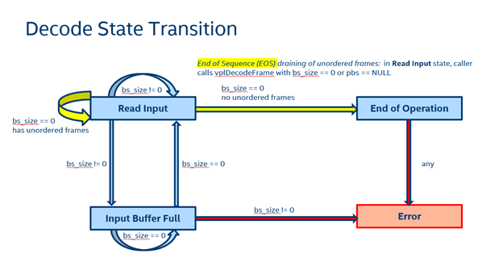

..
  Copyright 2020 Intel Corporation

.. _oneVPL-section:

========================
|vpl_full_name| (oneVPL)
========================

The |vpl_full_name| is a programming interface for all video/image
related usages, with focus on portable media pipeline on CPU, GPU, AI
accelerators and FPGA, media and compute/render interoperability, to
provide the best cross domain pipeline experience.  The Video
Processing Library provides the following features:

1. Decode and Video Post Processing
2. VPL-Memory Library for Image Object passing between media and
   compute/render, zero Buffer Copy among Different HW Engines
3. Encode
4. Transcoding Pipeline
5. Video Analytics Pipeline
6. Object Tracking and Optical Flow Library
7. Device Discovery and Device Capability Query 

Intel's implementation of VPL will be hosted at 
https://software.intel.com/en-us/oneapi/vpl# after release to public.

See `VPL API Reference`_ for a detailed API description.

-----------
Workstreams
-----------

The VPL API is defined around workstreams, which are referenced by
:cpp:type:`vplWorkstream`, an opaque pointer. See
:ref:`workstream-api` for all workstream APIs.

A Workstream defines a set of settable and gettable properties to configure:

* *Input and output*: image formats, frame rates, resolutions,
  cropping, aspect ratios
* *Internal settings*: maximum number of decoded image buffers,
  internal input raw data buffer size
* *Encoding preset and heuristics*: encoding bitrates, scenarios and
  target usage

:cpp:type:`VplWorkstreamProp` names all the properties. Get and set
the properites with :cpp:type:`vplGetConfigProperty` and
:cpp:func:`vplSetConfigProperty`.

------
Decode
------

The :cpp:class:`vpl::Decode` Workstream defines the API for video
decode and certain post processing of decoded frames. Inputs are
elementary bitstreams. Outputs are raw frames. The memory location of
a decoded image is stored in a :cpp:class:`vplm::memory` object, a
device independent memory abstraction for multi-hardware portability
and zero-copying memory sharing.

Supported Codecs
----------------

VPL can decode the following elementary bitstream formats:

=========  ========================
Codec      Notes
=========  ========================
AVC/H264   8 bit 4:2:0
HEVC/H265  8 bit 4:2:0 main profile
=========  ========================

The :cpp:func:`vpl::Decode::Decode` constructor takes a source format as
defined in :cpp:enum:`VplFourCC` and a targeted decoding devices in
:cpp:enum:`VplTargetDevice`, where :cpp:enumerator:`VPL_TARGET_DEVICE_DEFAULT` let the runtime to
choose the best target device.

Supported Video Post Processing Operations
------------------------------------------

VPL decode API also supports the following video post processing operations to
on the decoded outputs:

======================  =======================
Codec 	                Notes
======================  =======================
Color space conversion 	to NV12, I420, and RGBA
Resize                  up to 1920x1080
======================  =======================

To add Video Post Processing Operations to the default decode
operation, a programmer can use the :cpp:func:`vplSetConfigProperty`
to set various output color space formats and sizes.

Decode workstream state is defined in :cpp:enum:`vplWorkstreamState`.

		 
Decoding Sequence
-----------------

Member function for decoding a bitstream input and returning the decoded frames is
:cpp:func:`vpl::Decode::DecodeFrame`

New input data are passed to the decoder when :cpp:expr:`pbs != NULL &&
size != 0`. A pair of functions: :cpp:func:`vpl::Decode::DecodeFrame`
and :cpp:func:`vpl::Decode::GetState` work together to form a decoding
loop where the decoder can request the caller to send more data or
request it to retrieve decoded frames without sending new data.

By default, decoder returns the decoded frames in display order. It
will hold over one or more decoded frames if they are not the earliest
in the display order.  Hence, there are two conditions when it needs
additional inputs:

* The existing input does not contain a full frame of data to decode.
* The existing input does not contain the next to output frame data in
  display order.
* When either of the two above conditions occurs, Decode sets the
  :cpp:enumerator:`VPL_STATE_READ_INPUT` state for new input data.

  + Caller should call :cpp:func:`vpl::Decode::DecodeFrame` passing new inputs in pbs and
    bs_size arguments. Decode will return a decoded frame when it is
    the next in display order.
  + If Decode has additional outputs in display order to return, it
    sets the :cpp:enumerator:`VPL_STATE_INPUT_BUFFER_FULL` state.  Caller
    should call :cpp:func:`vpl::Decode::DecodeFrame` with bs_size = 0 to retrieve the remaining
    outputs until Decode again sets the
    :cpp:enumerator:`VPL_STATE_READ_INPUT` state for new input data.

* If the caller has no more data to decode, it can call :cpp:func:`vpl::Decode::DecodeFrame`
  with :cpp:expr:`pbs == NULL || bs_size == 0` indicating input has reached the
  End of Sequence (EOS).  Decode will return the remaining holdover
  frames one-by-one until there is no more output.  Decode then sets
  :cpp:enumerator:`VPL_STATE_END_OF_OPERATION` state and terminate the Workstream.

The Decode state transition diagram is illustrated below.
 

	   
Example Code
------------

Create a decoder workstream which decodes an H264 bitstream and
reformat the frames to RGBA and resize to 352x288.

.. code-block:: cpp

  // Create decoder, default device is GPU
  vpl::Decode decoder(VPL_FOURCC_H264);
  // Set output color format
  decoder.SetConfig(VPL_PROP_DST_FORMAT, VPL_FOURCC_RGBA);
  // Set output resolution
  VplVideoSurfaceResolution output_size = {352, 288};
  decoder.SetConfig(VPL_PROP_OUTPUT_RESOLUTION, output_size);

Main loop – read input bitstream and write to file.

.. code:: cpp

  vplWorkstreamState decode_state = VPL_STATE_READ_INPUT;
  for (; decode_state != VPL_STATE_END_OF_OPERATION &&
    decode_state != VPL_STATE_ERROR;
    decode_state = decoder.GetState()) {
    // read more input if state indicates buffer space
    // is available
    uint32_t bs_size = 0;
    if (decode_state == VPL_STATE_READ_INPUT) {
      bs_size = (uint32_t)fread(pbs, 1, BUFFER_SIZE, fInput);
    }
    // Attempt to decode a frame. If more data is needed read again
    vplm_mem image = decoder.DecodeFrame(pbs, bs_size);
    if (!image) continue;
    // If decode resulted in a frame of output write it to file
    vplWriteData(fOutput, image);
  }

------
Memory
------

The Memory API provides sharing of 1D buffers and 2D images across
different frameworks (e.g. SYCL, OpenCL, VAAPI, DXVA2) and different
devices (CPU, GPU).  Buffer sharing across the decode, compute and
encode pipeline is important for both performance and portability.

The buffer sharing mechanisms can be classified into 3 types:

1. *Direct* sharing when access is granted to the primary object's
   representation in physical memory, but this happens via different
   framework specific logical memory objects (like VAAPI surface or
   OpenCL memory). That's the case when handle from one framework can
   be converted to the handle of another framework. For example, via
   OpenCL VAAPI Sharing Extension.
2. *Mapping* when object is being mapped to the device memory and
   framework handle is generated. That's a typical case for CPU (HOST)
   access to the video memory. Underneath implementation might
   significantly vary and result in a kind of direct access or
   accessing a copy of the memory object with the set of associated
   copy and on-the-fly conversion operations. For example, OpenCL
   provides two sets of functions: clEnqueueReadBuffer,
   clEnqueueWriteBuffer for copying, and clEnqueueMapBuffer for direct
   mapping between CPU and OpenCL device.
3. *Coherent* sharing when memory object has unified addressing the
   physical memory and the underlying hardware and software system
   layers assures coherency between these representations as in a
   unified shared memory mode.

The Memory API aims to provide a sharing mechanism with the highest
performance. From this perspective, the library uses "direct" sharing
whenever possible. However, currently, there are a lot of various
restrictions coming from all over the software stack which makes
"direct" sharing unavailable:

1. Framework restrictions where some color formats are not supported,
   or lack of capability to import certain memory handle
2. Underlying driver implementation (or even HW) restrictions

As oneAPI software stack evolves, we intend to eliminate the *direct*
sharing restrictions in the underlying frameworks and drivers through
API extension and implementation enhancement.

The current VPL Memory Library provides the following *direct* sharing
capabilities:

* Sharing of CPU (HOST) allocated memory on Linux (via userptr):

  * With VAAPI driver
  * With OpenCL driver and SYCL
* Sharing of VAAPI allocated memory:
  
  * With OpenCL, SYCL
* Exporting dmabuf handle:
  
  * From VAAPI memory object

Recall that oneAPI platform is a host and a collection of devices; and
each device has an associated command queue.  Operations on the
devices are executed through submitting tasks to devices’ command
queues.  In the application domain of video processing pipeline, each
device may have multiple command queues corresponding to the media
driver, OpenCL and SYCL compute drivers and 3D graphics drivers.  For
Intel’s GPU on Linux, a VAAPI driver executes tasks for video
decoding, post processing and encoding, an OpenCL driver executes
tasks for compute such as DL inference, and an OpenGL driver executes
tasks for 3D rendering. Buffers and images allocated by these drivers
are initially only accessible in the context of their corresponding
command queues.  To share a buffer between a source and a sink command
queues, VPL Memory library must extract the buffer address from the
source command queue context, map the address to the sink command
queue context, such that, tasks in the sink command queue can now read
or write to the buffer.  We call this <command_queue,buffer> pair a
memory handler. Memory handlers are encapsulated in the
:cpp:class:`vplm::memory` class hierarchy.
    
To share a buffer to a device driver command queue context, just
simply constructs a new memory handler of the corresponding derived
class from the base :cpp:class:`vplm::memory` object.  For instance,
the code above converts a CPU allocated memory to a GPU VAAPI surface
for media processing.

In addition to the buffer sharing API in vplm::\*:memory
subclass constructors, VPL Memory API also provides:

* API to import memory already allocated by the application external
  to VPL Memory library
* API to allocate memory

The memory import and allocation functions are defined in
`vplm::cpu::make_memory`_, `vplm::opencl::make_memory`_,
`vplm::sycl::make_memory`_, and `vplm::vaapi::make_memory`_.

Creating memory objects
-----------------------

An application can use the VPL Memory Library to create a memory
object for one of the supported frameworks. For example, the following
code allocates memory in system memory (we count CPU (HOST) as one of
the frameworks):

.. code:: cpp

  #include <om++.h>

  vplm::cpu::memory yuv_image = vplm::cpu::make_memory(1920, 1080, VPLM_PIXEL_FORMAT_NV12);

or it can allocate memory externally and request the VPL Memory
Library to manage it as in the following example for VAAPI:

.. code:: cpp
	  
  #include <om++.h>
  #include <om_vaapi++.h>

  VADisplay dpy;
  VASurfaceID id;
  vaCreateSurfaces(dpy, VA_RT_FORMAT_RGB32, 1920, 1080, &id, 1, attribs, num_attribs);

  vplm::vaapi::memory rgb_image = vplm::vaapi::make_surface(dpy, id);

In either case, it ends up with the framework specific C++ object (in
our examples :cpp:class:`vplm::cpu::memory` or
:cpp:class:`vplm::vaapi::memory`), and hence, have access to the
framework specific API defined by VPL Memory for this object. For
example, the following code will access CPU allocated image (via
:cpp:class:`vplm::cpu_image` representation):

.. code:: cpp

  vplm::cpu_image image;
  yuv_image.map(VPLM_ACCESS_MODE_READ, image);

  // do something with the image since you have access to data pointers:
  printf("Y data pointer: %p\n", image.data(0));

  yuv_image.unmap(image);

Helper Class for Simplifying Image Data Access
----------------------------------------------

In the examples above we directly used a memory object to access its
data. While this is possible, there is a simpler way. Most frameworks
require a program to acquire and release access to data. For the CPU
access example, we saw calls to map and unmap to acquire/release
access to the data. Using the :cpp:class:`vplm::cpu_image` helper
class eliminates the need to map and unmap:

.. code:: cpp

  {
    vplm::cpu::image cpu_image(yuv_image, VPLM_ACCESS_MODE_READ);

    // do something with the image since you have access to data pointers:
    printf("Y data pointer: %p\n", image.data(0));
  }
  
This helper class issues acquire and release operations to mark
start/stop data access in constructor and destructor.  Another
"feature" of these helper classes is that they accept base
memory object (:cpp:class:`vplm::memory`) in constructors. This means that we can
use helper classes to make implicit convertion between different
framework objects. For example, with the following we will map our
VAAPI image on to CPU:

.. code:: cpp
	  
  {
    vplm::cpu::image cpu_image(rgb_image, VPLM_ACCESS_MODE_WRITE);

    // do something with the image since you have access to data pointers:
    printf("R data pointer: %p\n", image.data(0));
  }

Usage example
The following example summarize the key usage scenario:

.. code:: cpp
	  
  #include <om++.h>
  #include <om_vaapi++.h>

  VADisplay dpy = init_vaapi();
  VASurfaceID id = create_per_my_needs(); // calls vaCreateSurfaces inside

  vplm::cpu::memory yuv_image = vplm::cpu::make_memory(1920, 1080, VPLM_PIXEL_FORMAT_NV12);
  vplm::vaapi::memory rgb_image = vplm::vaapi::make_surface(dpy, id);

  {
    vplm::cpu::image cpu_image(yuv_image, VPLM_ACCESS_MODE_WRITE);

    // do something with the image since you have access to data pointers:
    printf("Y data pointer: %p\n", image.data(0));
    // for example, write data into the surface
  }

  {
    vplm::vaapi::image vaapi_cpu_image(dpy, yuv_image);
    vplm::vaapi::image vaapi_rgb_image(dpy, rgb_image); // just for consistency

    // do something with surfaces via VAAPI since we have access to them
    // for example, convert yuv which we just wrote on CPU to rgb format
    convert_yuv_to_rgb(vaapi_cpu_image.id(), vaapi_rgb_image.id())
  }

  {
    vplm::cpu::image cpu_image(rgb_image, VPLM_ACCESS_MODE_READ);

    // now we can read from the CPU data which we got in rgb image after VAAPI conversion:
    printf("R data pointer: %p\n", image.data(0));
  }

The VPL API defines 4 different helper classes, one for each supported device context: 
:cpp:class:`vplm::cpu::image`
:cpp:class:`vplm::opencl::image`,
:cpp:class:`vplm::sycl::memory` and
:cpp:class:`vplm::vaapi::image`.

--------------
VPL Encode API
--------------

The oneVPL Encode API will be released in sync with Intel's oneAPI reference 
implementation release in 2020.

-----------------
VPL Transcode API
-----------------

The oneVPL Transcode API will be released in sync with Intel's oneAPI
reference implementation release in 2020.

----------------------------
VPL Video Analytics Pipeline
----------------------------

The oneVPL Video Analytics Pipeline API will be released in sync with
Intel's oneAPI reference implementation release in 2020.

--------------------------------------------
VPL Object Tracking and Optical Flow Library
--------------------------------------------

The oneVPL Object Tracking and Optical Flow Library API API will be
released in sync with Intel's oneAPI reference implementation release
in 2020.

------------------------------------------------
VPL Device Discovery and Device Capability Query
------------------------------------------------

The oneVPL Device Discovery and Device Capability Query API will be
released in sync with Intel's oneAPI reference implementation release
in 2020.

-----------------
VPL API Reference
-----------------

Error Handling
--------------

vplStatus
~~~~~~~~~~~~~~~~~

.. doxygenenum:: vplStatus
   :project: oneVPL

.. _workstream-api:

Workstreams
-----------

VplWorkstreamType
~~~~~~~~~~~~~~~~~

.. doxygenenum:: VplWorkstreamType
   :project: oneVPL

VplWorkstreamProp
~~~~~~~~~~~~~~~~~

.. doxygenenum:: VplWorkstreamProp
   :project: oneVPL

vplWorkstream
~~~~~~~~~~~~~

.. doxygentypedef:: vplWorkstream
   :project: oneVPL
	     
vplSetConfigProperty
~~~~~~~~~~~~~~~~~~~~

.. doxygenfunction:: vplSetConfigProperty
   :project: oneVPL

vplGetConfigProperty
~~~~~~~~~~~~~~~~~~~~

.. doxygenfunction:: vplGetConfigProperty
   :project: oneVPL

Decode
------

vpl::Decode
~~~~~~~~~~~

.. doxygenenum:: vplWorkstreamState
   :project: oneVPL

.. doxygenclass:: vpl::Decode
   :project: oneVPL
   :members:
   :protected-members:
   :undoc-members:   

Memory
------

vplm::cpu_image
~~~~~~~~~~~~~~~

.. doxygenclass:: vplm::cpu_image
   :project: oneVPL
   :members:
   :protected-members:
   :undoc-members:   

vplm::memory
~~~~~~~~~~~~

.. doxygenclass:: vplm::memory
   :project: oneVPL
   :members:
   :protected-members:
   :undoc-members:   

vplm::cpu::memory
~~~~~~~~~~~~~~~~~

.. doxygenclass:: vplm::cpu::memory
   :project: oneVPL
   :members:
   :protected-members:
   :undoc-members:   

vplm::cpu::image
~~~~~~~~~~~~~~~~

.. doxygenclass:: vplm::cpu::image
   :project: oneVPL
   :members:
   :protected-members:
   :undoc-members:   

vplm::cpu::make_memory
~~~~~~~~~~~~~~~~~~~~~~

.. doxygennamespace:: vplm::cpu
   :outline:
   :project: oneVPL
   :undoc-members:   

vplm::opencl::memory
~~~~~~~~~~~~~~~~~~~~

.. doxygenclass:: vplm::opencl::memory
   :project: oneVPL
   :members:
   :protected-members:
   :undoc-members:   

vplm::opencl::image
~~~~~~~~~~~~~~~~~~~

.. doxygenclass:: vplm::opencl::image
   :project: oneVPL
   :members:
   :protected-members:
   :undoc-members:   

vplm::opencl::make_memory
~~~~~~~~~~~~~~~~~~~~~~~~~

.. doxygennamespace:: vplm::opencl
   :outline:
   :project: oneVPL

vplm::sycl::memory
~~~~~~~~~~~~~~~~~~

.. doxygenclass:: vplm::sycl::memory
   :project: oneVPL
   :members:
   :protected-members:
   :undoc-members:   

vplm::sycl::image
~~~~~~~~~~~~~~~~~

.. doxygenclass:: vplm::sycl::image
   :project: oneVPL
   :members:
   :protected-members:
   :undoc-members:   

vplm::sycl::make_memory
~~~~~~~~~~~~~~~~~~~~~~~

.. doxygennamespace:: vplm::sycl
   :outline:
   :project: oneVPL

vplm::vaapi::memory
~~~~~~~~~~~~~~~~~~~

.. doxygenclass:: vplm::vaapi::memory
   :project: oneVPL
   :members:
   :protected-members:
   :undoc-members:   

vplm::vaapi::image
~~~~~~~~~~~~~~~~~~

.. doxygenclass:: vplm::vaapi::image
   :project: oneVPL
   :members:
   :protected-members:
   :undoc-members:   

vplm::vaapi::make_memory
~~~~~~~~~~~~~~~~~~~~~~~~

.. doxygennamespace:: vplm::vaapi
   :outline:
   :project: oneVPL
		     

Miscellaneous
-------------

VplFourCC
~~~~~~~~~

.. doxygenenum:: VplFourCC
   :project: oneVPL

VplTargetDevice
~~~~~~~~~~~~~~~

.. doxygenenum:: VplTargetDevice
   :project: oneVPL

